# 🚀 Codex StartUp Tools for Linux

> 🐧 Linux 上で `/home/kensan/Projects` 配下の登録プロジェクト候補から Codex を起動し、番号選択したプロジェクトへ Supervisor 設定を安全に適用する Codex 専用スタートツールです。

[](https://github.com/Kensan196948G/Codex-StartUpTools-New-Linux/actions/workflows/ci.yml)

## 🧭 正本

| アイコン | 項目 | 正本 |
|---|---|---|
| 📘 | README | 起動手順、運用ルール、リリース判断の正本 |
| ⚙️ | `config/config.json.template` | Linux / Codex only の既定設定 |
| 🧪 | `tests/unit` | MVP機能の回帰防止 |
| 🏗️ | `scripts/lib/ArchitectureCheck.psm1` | スクリプト構造の品質ゲート |
| 🧾 | `docs/releases/` | リリースごとの運用記録 |

## ✅ 現在のスコープ

| 状態 | 項目 | 内容 |
|---|---|---|
| ✅ | 対象OS | Linux / PowerShell 7+ |
| ✅ | 起動入口 | `./start.sh` |
| ✅ | Codex起動 | `/home/kensan/Projects` 配下の候補を番号選択 |
| ✅ | 自律モード | `--full-auto` + `cto-autonomous` |
| ✅ | Supervisor適用 | 番号付き個別選択、preview、`yes` 確認 |
| ✅ | Supervisorレポート | 登録プロジェクトの `Managed / Missing / Foreign / Invalid` 集計 |
| ✅ | Supervisor差分表示 | 上書き前に既存manifestとの差分を表示 |
| 🚫 | SSH接続 | 削除。ローカルプロジェクト起動のみ |
| 🚫 | Claude / Copilot起動 | 対象外 |
| 🧑 | 人間判断 | `final-choice`, `merge`, `release`, public化 |

## 🗺️ メニュー構成

| 番号 | アイコン | 機能 | 説明 |
|---:|---|---|---|
| `L1` | 🚀 | Codexを起動 | 登録プロジェクト候補からCodexを起動 |
| `1` | 📊 | プロジェクトダッシュボード | Git / テスト / Token / フェーズを表示 |
| `2` | 🩺 | MCPヘルスチェック | MCPサーバーの状態を確認 |
| `3` | 🏗️ | Architecture Check | 設計違反・秘密情報の静的解析 |
| `4` | 🌿 | Worktree Manager | Git worktreeの一覧・作成・削除 |
| `5` | 🧮 | Token Budget確認 | トークン使用状況と残量ゾーンを表示 |
| `6` | 🧪 | Bootstrap実行 | 設定・ツール・CIの事前確認 |
| `7` | 🕘 | 最近のプロジェクト一覧 | 履歴から再起動 |
| `8` | 🛡️ | Supervisor適用 | 番号選択した登録プロジェクトへ適用 |
| `9` | 📋 | Supervisorレポート | 登録プロジェクトの適用状況を一覧化 |
| `10` | 📨 | MessageBusログ | フェーズ遷移ログを確認 |
| `11` | 🗂️ | プロジェクト候補管理 | 登録候補の除外・カテゴリを番号で管理 |
| `12` | ✅ | リリース前チェック | Pester / Architecture / DryRun / README / Git状態を統合確認 |
| `13` | 🔀 | GitHub PR確認 | Draft PR / CI / gh auth を確認。作成は明示実行 |

## 🧩 全体アーキテクチャ

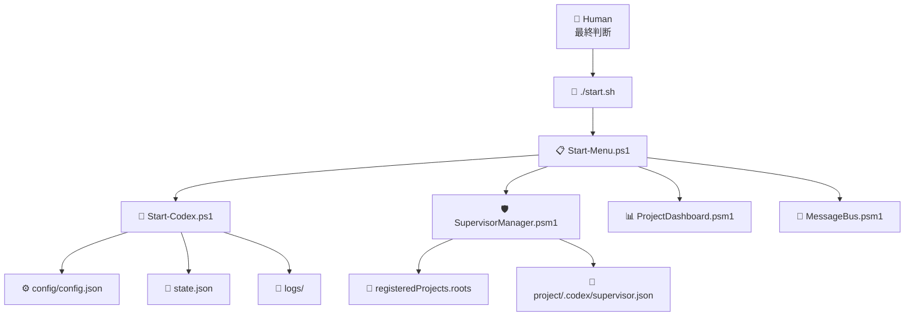

## 🚀 Codex起動フロー

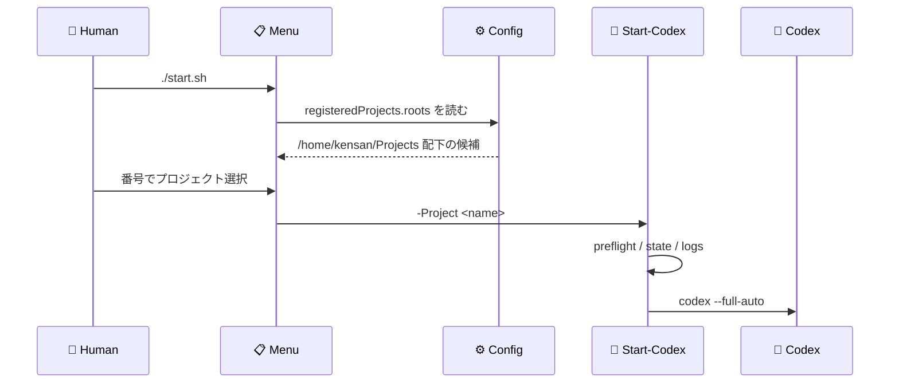

## 🛡️ Supervisor運用

Supervisor は、各登録プロジェクトへ `.codex/supervisor.json` を配布します。通常運用では `all` を使わず、番号で人間が対象を最終選択します。

```json
{
  "mode": "cto-autonomous",
  "agentLoop": ["monitor", "build", "verify", "improve"],
  "codexOnly": true,
  "sshEnabled": false,
  "humanDecisionRequired": ["final-choice", "merge", "release"]
}
```

### 🧭 適用フロー

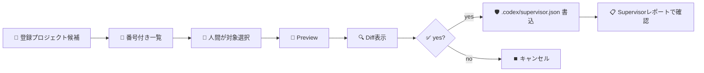

### 🔍 更新差分表示

Supervisor適用前のpreviewでは、既存manifestがある場合にポリシー差分を表示します。`supervisorAppliedAt` は更新時に必ず変わるため、ポリシー差分からは分離して扱います。

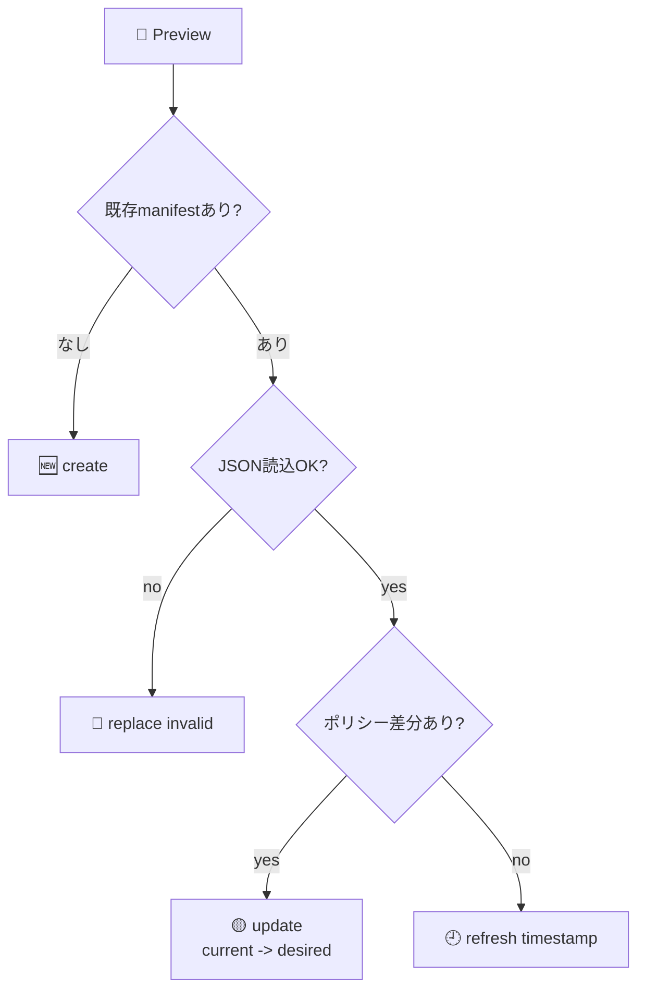

| アクション | 表示内容 |
|---|---|
| 🆕 `create` | 新規manifest作成予定 |
| 🟡 `update` | `property: current -> desired` の差分 |
| 🔴 `replace invalid` | 不正JSONを置換する予定とparse error |
| 🕘 `refresh timestamp` | ポリシー変更なし、適用日時のみ更新 |

### 📋 v0.2.0 Supervisorレポート

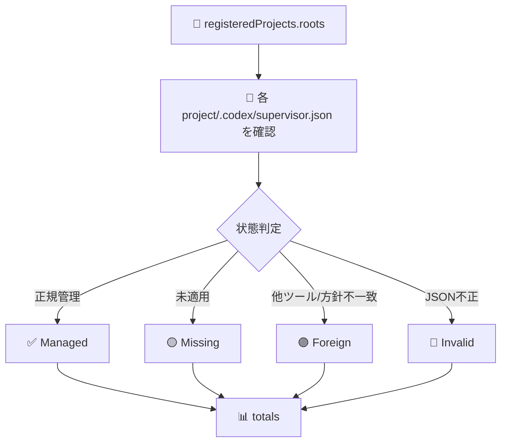

| 状態 | 意味 | 次の判断 |
|---|---|---|
| ✅ `Managed` | 本ツール管理、`codexOnly=true`、`sshEnabled=false` | 継続利用 |
| 🟡 `Missing` | Supervisor未適用 | 必要なら番号選択で適用 |
| 🟣 `Foreign` | 既存ファイルあり。ただし本ツール管理ではない | 差分確認後に人間判断 |
| 🔴 `Invalid` | JSONとして読めない | 手動修正または退避後に再適用 |

## 🗂️ 登録プロジェクト候補管理

`11. プロジェクト候補管理` では、`registeredProjects.roots` 配下の候補を一覧し、番号入力で除外・復帰・カテゴリ付与を行います。変更は `config/config.json` へ保存されます。

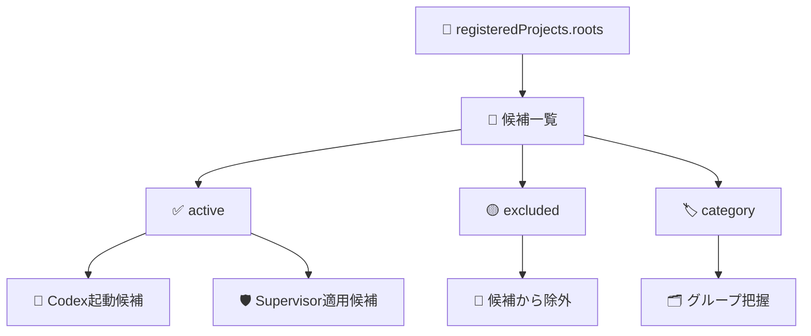

| 入力 | 操作 | 例 |
|---|---|---|
| `+番号` | 除外へ追加 | `+1,3` |
| `-番号` | 除外から復帰 | `-2` |
| `c番号:カテゴリ` | カテゴリ付与 | `c1,3:startup-tools` |
| `0` | 戻る | `0` |

設定例:

```json
{
  "registeredProjects": {
    "roots": ["/home/kensan/Projects"],
    "include": [],
    "exclude": ["ArchivedProject"],
    "categories": {
      "startup-tools": ["Codex-StartUpTools-New-Linux"]
    }
  }
}
```

## 🧑‍⚖️ 判断権限

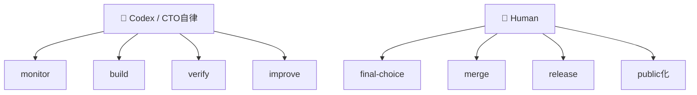

| 領域 | 担当 | ルール |
|---|---|---|
| 実装 | 🤖 Codex / CTO | 既存構造を尊重して自律実行 |
| テスト | 🤖 Codex / CTO | Pester、ArchitectureCheck、DryRun |
| 対象選択 | 👤 Human | Supervisor適用先は番号選択 |
| merge | 👤 Human | 最終判断は人間 |
| release/tag | 👤 Human | 最終判断は人間 |
| public/private | 👤 Human | 公開判断は人間 |

## ⚙️ セットアップ

```bash
git clone https://github.com/Kensan196948G/Codex-StartUpTools-New-Linux.git
cd Codex-StartUpTools-New-Linux
chmod +x start.sh
cp config/config.json.template config/config.json
pwsh scripts/main/Start-CodexBootstrap.ps1 -DryRun
```

## 🕹️ 使い方

```bash
./start.sh
pwsh scripts/main/Start-Codex.ps1 -Project Codex-StartUpTools-New-Linux -DryRun -NonInteractive
pwsh scripts/main/Start-CodexBootstrap.ps1 -DryRun
```

`registeredProjects.roots` の既定値は `/home/kensan/Projects` です。直下フォルダが登録プロジェクト候補として扱われます。

## 🧪 検証コマンド

```bash
pwsh -NoProfile -Command 'Import-Module Pester -MinimumVersion 5.0 -Force; Invoke-Pester -Path tests/unit -Output Normal'
pwsh -NoProfile -Command 'Import-Module ./scripts/lib/ArchitectureCheck.psm1 -Force; Invoke-ArchitectureCheck -Path ./scripts'
pwsh -NoProfile -File scripts/main/Start-Codex.ps1 -Project Codex-StartUpTools-New-Linux -DryRun -NonInteractive
pwsh -NoProfile -File scripts/main/Invoke-ReleaseCheck.ps1
```

## ✅ リリース前チェック統合コマンド

`scripts/main/Invoke-ReleaseCheck.ps1` は、v0.2.0以降の人間リリース判断前に実行する統合ゲートです。開発中の確認だけなら `-AllowDirty` を付けられますが、正式リリース前はdirty worktreeを失敗として扱います。

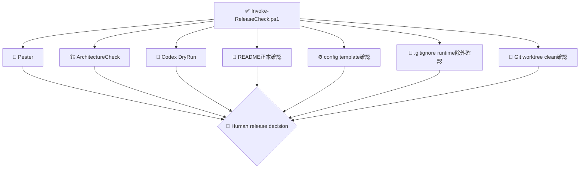

| コマンド | 用途 |
|---|---|
| `pwsh -NoProfile -File scripts/main/Invoke-ReleaseCheck.ps1` | 正式なリリース前チェック |
| `pwsh -NoProfile -File scripts/main/Invoke-ReleaseCheck.ps1 -AllowDirty` | 開発中の暫定確認 |
| `pwsh -NoProfile -File scripts/main/Invoke-ReleaseCheck.ps1 -SkipPester -SkipDryRun -AllowDirty` | 軽量な設定・文書・Git確認 |
| `pwsh -NoProfile -File scripts/main/Invoke-ReleaseCheck.ps1 -Json` | JSON形式の結果出力 |

## 🔀 GitHub PR作成/確認フロー

`scripts/main/Invoke-GitHubPrFlow.ps1` は、現在ブランチのDraft PRとCI状態を確認するための安全運用コマンドです。通常実行では確認だけを行い、PR作成は `-CreateDraft` を明示した場合だけ実行します。mergeは実行しません。

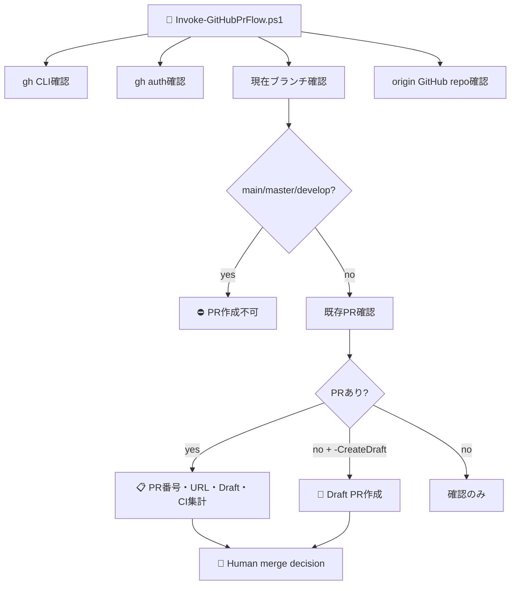

| コマンド | 用途 |
|---|---|
| `pwsh -NoProfile -File scripts/main/Invoke-GitHubPrFlow.ps1` | 既存PRとCI状態を確認 |
| `pwsh -NoProfile -File scripts/main/Invoke-GitHubPrFlow.ps1 -CreateDraft` | Draft PRがない場合だけ作成 |
| `pwsh -NoProfile -File scripts/main/Invoke-GitHubPrFlow.ps1 -Json` | JSON形式の結果出力 |

安全ルール:

1. `main`, `master`, `develop` ではPR作成しない。
2. 作成するPRはDraft固定。
3. merge、release、public化は人間判断。
4. PRが既にある場合は重複作成しない。

## 🧾 リリース履歴と次フェーズ

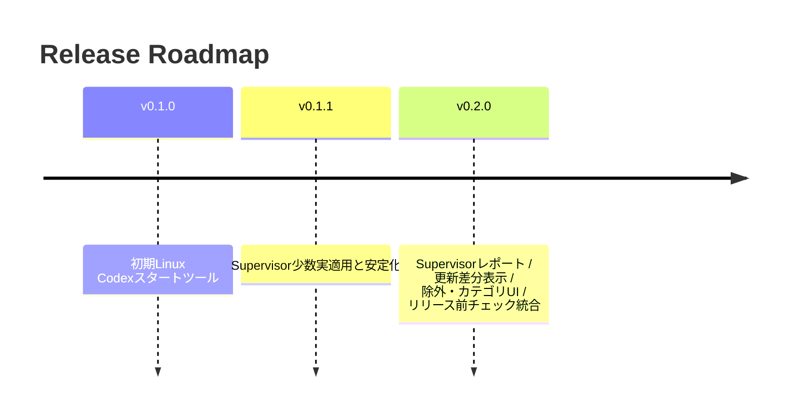

| バージョン | 状態 | 内容 |
|---|---|---|
| ✅ `v0.1.0` | 完了 | Linuxローカル起動MVP |
| ✅ `v0.1.1` | 完了 | Supervisor少数適用、運用安定化 |
| 🚧 `v0.2.0` | 開発中 | Supervisor適用結果レポート、更新差分表示、除外・カテゴリUI、リリース前チェック統合、GitHub PR確認 |

## 🔐 安全運用ルール

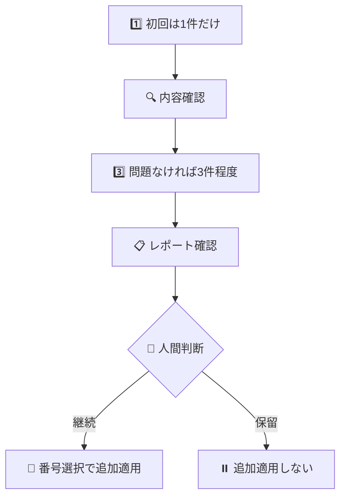

1. 初回は必ず1件だけSupervisorを適用する。
2. 問題なければ3件程度へ追加適用する。
3. `all` は原則使わない。
4. `Foreign` と `Invalid` は上書き前に必ず確認する。
5. merge、release、public化、最終選択は人間判断とする。

## 📦 Git管理方針

| 対象 | 管理 |
|---|---|
| ✅ `config/config.json.template` | Git管理する |
| ✅ `.codex/supervisor.json` | このリポジトリ自身のSupervisor設定はGit管理する |
| 🚫 `config/config.json` | Git管理外 |
| 🚫 `state.json` | Git管理外 |
| 🚫 `logs/` | Git管理外 |
| 🚫 外部プロジェクトの `.codex/supervisor.json` | 各プロジェクト側の判断。ここでは勝手にcommitしない |

## 🧠 Source of Truth Policy

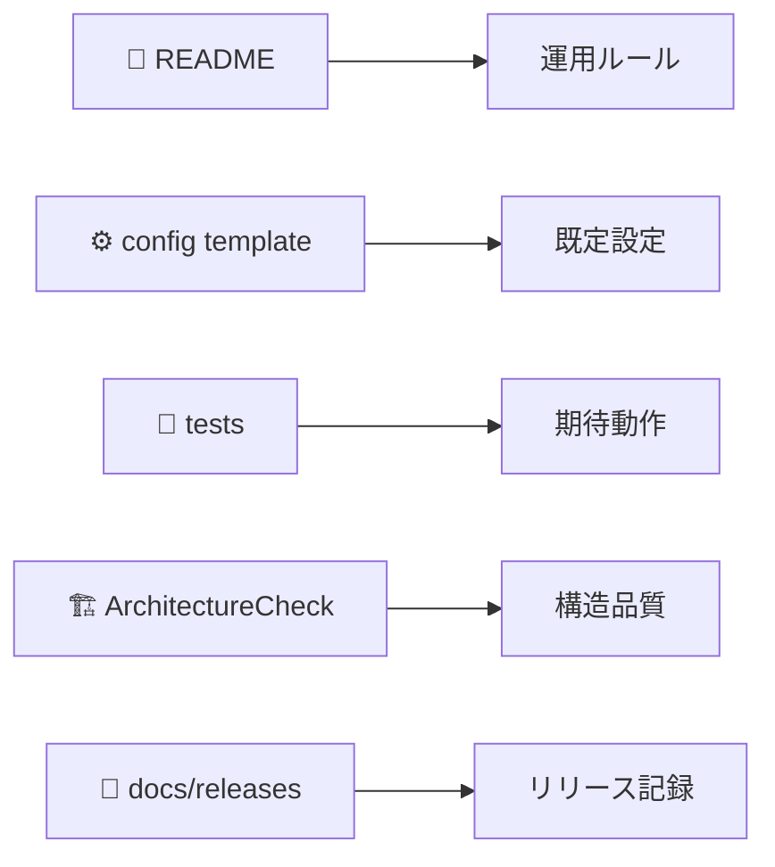

README、設定テンプレート、テスト、ArchitectureCheck、リリースノートを正本として扱います。コード変更時は、該当する正本も同じコミットで更新します。
