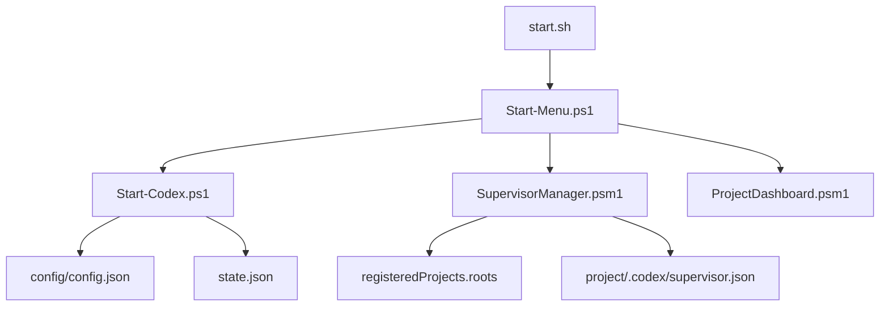

# Codex StartUp Tools for Linux

> Linux 上で、`/home/kensan/Projects` 配下の登録プロジェクト候補から Codex を起動し、選択したプロジェクトへ Supervisor 設定を配布する Codex 専用スタートツールです。

[](https://github.com/Kensan196948G/Codex-StartUpTools-New-Linux/actions/workflows/ci.yml)

## 概要

| 項目 | 内容 |
|---|---|
| 対象ツール | Codex only |
| 対象 OS | Linux / PowerShell 7+ |
| プロジェクト候補 | `registeredProjects.roots` 直下のフォルダ |
| 既定候補 root | `/home/kensan/Projects` |
| Supervisor | 番号選択した登録プロジェクトへ `.codex/supervisor.json` を配布 |
| SSH接続 | 削除。ローカルプロジェクト起動のみ |
| 自律モード | `--full-auto` + `cto-autonomous` |

## アーキテクチャ



## セットアップ

```bash
git clone https://github.com/Kensan196948G/Codex-StartUpTools-New-Linux.git
cd Codex-StartUpTools-New-Linux
chmod +x start.sh
cp config/config.json.template config/config.json
pwsh scripts/main/Start-CodexBootstrap.ps1 -DryRun
```

## 使い方

```bash
./start.sh
pwsh scripts/main/Start-Codex.ps1 -Project YourProject -DryRun
pwsh scripts/main/Start-CodexBootstrap.ps1 -DryRun
```

メニューでは `/home/kensan/Projects` 直下のフォルダを候補として表示します。候補を選ぶと、そのフォルダを作業ディレクトリにして Codex を起動します。

## Supervisor

Supervisor は登録プロジェクト候補へ `.codex/supervisor.json` を配布します。Linux版では意図しない全件書き込みを避けるため、メニューで候補を番号付き表示し、`1,3,5` のように選んだプロジェクトだけへ適用します。`all` を明示入力した場合だけ全候補を対象にできます。

```json
{
  "mode": "cto-autonomous",
  "agentLoop": ["monitor", "build", "verify", "improve"],
  "codexOnly": true,
  "sshEnabled": false,
  "humanDecisionRequired": ["final-choice", "merge", "release"]
}
```

設計方針:

1. Codex が monitor/build/verify/improve を自律実行する。
2. SSH/Claude/Copilot 起動は対象外。
3. merge、release、最終選択は人間判断として残す。
4. Supervisor 適用は番号選択、preview、`yes` 確認後に書き込む。

## v0.1.1 安定化メモ

v0.1.1 では、Supervisor を少数の実プロジェクトへ段階適用して確認します。

適用済み:

| 順序 | プロジェクト | 確認 |
|---|---|---|
| 1件目 | `Codex-StartUpTools-New-Linux` | `.codex/supervisor.json` 作成、`sshEnabled=false` 確認 |
| 追加3件 | `Claude-StartUpTools-New-Linux` | `.codex/supervisor.json` 作成確認 |
| 追加3件 | `ClaudeCode-StartUpTools-New` | `.codex/supervisor.json` 作成確認 |
| 追加3件 | `Codex-StartUpTools` | `.codex/supervisor.json` 作成確認 |

運用ルール:

1. 業務プロジェクトへ展開する前に、スタートアップツール系プロジェクトで確認する。
2. `all` は原則使わず、番号選択で適用する。
3. 既存 `.codex/supervisor.json` がある場合は、上書き前に差分確認する。
4. public化、正式リリース、広範囲適用は人間の最終判断で行う。

## 検証

```bash
pwsh -NoProfile -Command 'Import-Module Pester -MinimumVersion 5.0 -Force; Invoke-Pester -Path tests/unit -Output Detailed'
pwsh -NoProfile -Command 'Import-Module ./scripts/lib/ArchitectureCheck.psm1 -Force; Invoke-ArchitectureCheck -Path ./scripts'
```

## 現在の方針

| 方針 | 状態 |
|---|---|
| Linux 用 Codex スタートツール | Active |
| SSH 接続機能 | Removed from runtime |
| Claude / Copilot 起動 | Removed from runtime |
| Project root 候補登録 | `registeredProjects.roots` で管理 |
| Supervisor 個別選択適用 | `StartupMenu.psm1` + `SupervisorManager.psm1` で実装 |
