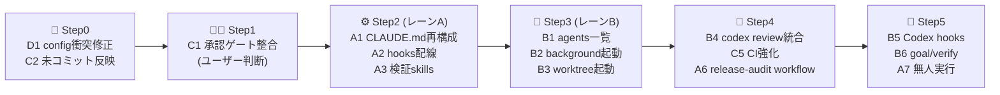

# 📌 Claude Code 最新機能 取り込み調査（2026-09-07）

状態: 調査・検討完了（実装未着手）
対象: 本リポジトリ（Codex StartUp Tools for Linux）の「機能追加・機能アップ・開発効率化」
調査者: Claude Code（Fable 5.1）

## 📋 1. 調査対象と方法

| 種別 | 対象 | 取得方法 |
|---|---|---|
| 公式changelog | `code.claude.com/docs/en/changelog`（v2.1.248〜v2.1.263、2026-08-27〜09-06） | 全文取得 |
| 公式docs | `agents`（並列実行の比較）、`agent-view`、`agent-teams`、`workflows`、`sub-agents`、`hooks`、`worktrees`、`cross-session-messaging`、`routines`、`scheduled-tasks`、`goal`、`channels`、`headless`、`commands`、`skills`、`memory`、`code-review`、`self-hosted-environments` | 全文取得 |
| ブログ | agents / claude-code / enterprise-ai / announcements の4カテゴリ一覧 + 主要9記事（Verification loops、AI-Native SDLC playbook、Maximizing sessions、Auto mode in production、Own compute、Context engineering、CI/CD on-call、Startups guide、Secure SDLC、MCP 2026-07-28、Warp、Datadog） | 全文取得 |
| ローカル環境 | `claude 2.1.263`、`codex-cli 0.153.4`（DeepSeek V4）、`pwsh 7.6.4`、`~/.claude`、`~/.codex`、本リポジトリの構成・CI・GitHub Ruleset | 実測 |

## 🔍 2. 現状診断（取り込み前に把握すべき事実）

### 2.1 ❗ 先に直すべき問題（P1）

| # | 問題 | 根拠 | 影響 |
|---|---|---|---|
| D1 | 🔴 `.codex/config.toml` の `mcp_servers.context7`（stdio/npx定義）がユーザー設定の `context7`（url定義）と衝突し、このプロジェクト配下で Codex の設定ロードが失敗する | `codex features list` が `url is not supported for stdio in mcp_servers.context7` で失敗。`/tmp` では成功 | Codex 起動・機能フラグ確認が本プロジェクトで不安定になる |
| D2 | 🔴 方針の三重衝突。組織方針（`/etc/claude-code/CLAUDE.md`）は品質ゲート付き自動マージ、`GITHUB_POLICY.md`（未コミット）も自動マージ、プロジェクト `CLAUDE.md` §6 / `AGENTS.md` / README は「mainマージは人間Y/N」 | 各ファイル実読 | Codex と Claude Code で承認挙動が食い違う。自動化を進める前に決着が必要 |
| D3 | 🟡 `GITHUB_POLICY.md` と `AGENTS.md` 末尾追記（中央ポリシー配布）が未コミット | `git status` | 中央ポリシーの配布が完了していない |
| D4 | 🟡 `~/.codex/config.toml` の MCP `http_headers` にトークンが平文で埋め込まれている（値は本書に記載しない） | 実読 | 設定ファイルの共有・バックアップで漏洩リスク。`env_http_headers` へ移行推奨 |

### 2.2 Claude Code 側の現状（本リポジトリ）

| 項目 | 状態 |
|---|---|
| `.claude/`・`CLAUDE.md` | `.gitignore` で除外（ローカル専用） |
| `.claude/settings.json` | 存在しない。**hooks 18本（`.claude/claudeos/scripts/hooks/*.js`）は未配線で死蔵** |
| `.claude/CLAUDE.md` | 32KB（推奨は200行以下）。`/agents` パネル、`teammateDefaultModel`、`Opus 4.8 最新` など現行仕様と不一致の記述あり |
| `.claude/rules` `.claude/skills` `.claude/workflows` `.claude/agents` | なし |
| `REVIEW.md` | なし |
| `~/.claude/settings.json` | hooks なし。`enabledPlugins` あり |

### 2.3 Codex 側の現状（本リポジトリ）

| 項目 | 状態 |
|---|---|
| Codex features | `hooks` `goals` `multi_agent` `plugins` `apps` が **stable / 有効**。`memories` は stable だが無効 |
| `.codex/hooks.json` | 空配列（PascalCase キー）。`.codex/hooks/hooks.json` は名前のみで実装なし |
| `.codex/agents/*.toml` | 30 本の役割定義あり（`multi_agent` で利用可能） |
| `.agents/skills` | 67 本（用途未整理） |
| Codex CLI 能力 | `codex agents`（app-server daemon 上のセッション一覧）、`codex exec --json -o --output-schema`、`codex review --base/--uncommitted/--commit`、`codex queue --thread`、`codex fork`、`codex cloud exec --env`、`codex app-server daemon` |

### 2.4 CI / GitHub

| 項目 | 状態 |
|---|---|
| CI jobs | Pester、PSScriptAnalyzer（**warning のみ・失敗しない**）、schema validation、ArchitectureCheck |
| 未整備 | secret scan、依存関係監査、Codex review ゲート、`lint` の fail 化 |
| Ruleset | `central-auto-merge`（active）、`allow_auto_merge=true`、`delete_branch_on_merge=true` |

## 📖 3. 情報源サマリ（要点のみ）

### 3.1 changelog v2.1.248→v2.1.263 で本件に関係する追加

| 版 | 機能 | 本リポジトリでの意味 |
|---|---|---|
| 2.1.261 | `/skill-doctor`、`bashOutputMaxChars` / `taskOutputMaxChars`、`--append-subagent-system-prompt-file` | skills棚卸し、長い Pester 出力の取り込み |
| 2.1.260 | `/diff` パネル、`/cost` にキャッシュミス原因表示、`/ultrareview` 45分待機 | レビュー・コスト可視化 |
| 2.1.259 | `--permission-prompts none`（無人実行）、`managedMcpServers`、`claude plugin validate --json` | cron / 無人 `claude -p` |
| 2.1.257 | Fable 5.1 既定化（1M context）、`CLAUDE_CODE_SUBAGENT_MODEL_FORCE`、`permissions.blockReadsOutsideWorkingDirectories`、`.claude/settings.json` の `defaultMode: bypassPermissions` 無視 | サブエージェント低コスト化、権限設計 |
| 2.1.251 | `PreModelSwitch` / `PostModelSwitch` hook、`/cost` prompt-cache 行 | hooks 拡充 |
| 2.1.248 | `--restricted`、`experimental.cacheTtl`、Bedrock 等でのクロスセッション通信 | 制限付きサブエージェント |

### 3.2 並列実行4方式（`docs/en/agents`）

| 方式 | 誰が指揮 | 用途 | 本リポジトリでの適用 |
|---|---|---|---|
| Subagents | Claude（会話内） | 検索・検証などの副作業 | モジュール単位の Pester 実行、ログ隔離 |
| Agent view（`claude agents`, `claude --bg`） | 人間が投げて後で確認 | 独立タスクの並列 | 複数モジュールの並行改修（worktree 自動隔離） |
| Agent teams（実験的） | リード Claude | 相互通信が要る協調作業 | 現状は不要（コスト高・実験的） |
| Dynamic workflows（`/workflows`, `ultracode`） | スクリプト | 数十〜数百エージェント、相互検証 | リリース監査、全モジュール一斉監査 |

補助: worktrees（`--worktree`、`isolation: worktree`、`.worktreeinclude`）、cross-session messaging（`ListAgents` / `SendMessage`）、`/batch`。

### 3.3 ブログからの実務指針

- **Verification loops**: 手作業の検証を skill に落とし、embedded / chained / on-every-PR の4形態で回す。まず `/verify` を試す
- **AI-Native SDLC playbook**: `intent.md → spec.md → plan.md → CLAUDE.md → REVIEW.md` の成果物連鎖が監査証跡。hooks は決定論的ゲート、skills は組織知
- **Context engineering（Claude 5世代）**: `CLAUDE.md` は軽量に、詳細は progressive disclosure。`/doctor` でトリム
- **Maximizing sessions**: `/model` `/effort` はセッション冒頭で固定、`/rewind` はキャッシュ温存、うるさい出力はサブエージェントへ
- **Auto mode in production**: 危険コマンドは skills / hooks で先に拒否、外部通信系は自動承認しない
- **Secure SDLC**: エージェントごとに単一目的の最小権限、承認は人間ゲート、`/security-review` を CI 段階へ
- **CI/CD on-call**: `lessons.md` の蓄積と再読で改善ループ
- **Warp**: skills（安定・意図的変更）と memory（自動・揮発）を分離、improver skill で skills を改善
- **MCP 2026-07-28**: request/response 化、Tasks / Apps 拡張、OAuth/OIDC 準拠

## 🧭 4. 取り込み候補の評価（3レーン）

評価軸: 効果（機能追加 / 機能アップ / 効率化）、コスト、リスク、前提（プラン・スコープ）。
スコープ制約: 本リポジトリは **Codex only**（Claude 起動機能は実装対象外）。よって Claude Code の取り込みは「本リポジトリを開発する側の効率化（レーンA）」と「概念を Codex ツールへ移植（レーンB）」に分ける。

### レーンA: Claude Code を本リポジトリ開発の補助として活用（開発効率化）

| ID | 候補 | 元機能 | 効果 | 優先 | 前提・注意 |
|---|---|---|---|---|---|
| A1 | `CLAUDE.md` を `@AGENTS.md` import + Claude 固有数行へ再構成。`.claude/CLAUDE.md`（32KB）を `.claude/rules/*.md`（`paths` 付き）と skills へ分割 | memory docs、context engineering | コンテキスト削減、キャッシュ効率、二重管理解消 | **P1** | `.gitignore` の `.claude/` `CLAUDE.md` 除外を見直す判断が必要（共有したい設定だけ Git 管理へ） |
| A2 | `.claude/settings.json` に hooks を配線。`PreToolUse(Bash: git commit)`→Pester/ArchitectureCheck ゲート、`PostToolUse(Edit\|Write *.ps1)`→PSScriptAnalyzer（`async`）、`SessionStart`/`Stop`→state.json、`PreCompact`→退避 | hooks docs、既存 18 本 | 死蔵 hooks の再生、決定論的品質ゲート | **P1** | 既存 JS は Claude 旧仕様（`TeamCreate` 等）依存あり。使う数本だけ検証して配線 |
| A3 | 検証 skills を追加: `verify-release`（`Invoke-ReleaseCheck.ps1`）、`verify-module`（対象 psm1 の Pester）、`supervisor-dryrun`。`/code-review high --fix` → `/simplify` → `verify-release` の chained パターン | Verification loops、skills docs | 検証の自動化・再現性 | **P1** | `disable-model-invocation` で誤発火防止、`allowed-tools` を最小に |
| A4 | `REVIEW.md` を追加（PowerShell リポジトリ向け重大度較正、`logs/`・`docs/releases/` の除外、「テスト未追加のモジュール変更は Important」など） | Code Review docs | レビュー精度向上 | P2 | managed Code Review は Team/Enterprise 限定。ローカル `/code-review` は `REVIEW.md` を読まないため CLAUDE.md 側にも要点を置く |
| A5 | `claude --bg` + Agent view + worktree 自動隔離で複数モジュールを並行改修。`.worktreeinclude` に `config/config.json` `state.json` を登録 | agent-view、worktrees | 並列開発、衝突防止 | P2 | `worktree.baseRef` は既定 `fresh`。作業ブランチ継続なら `head` |
| A6 | 保存型 dynamic workflow `.claude/workflows/release-audit.js`（モジュール単位 Pester + ArchitectureCheck + README 整合を fan-out し相互検証） | workflows docs | リリース前監査の網羅性 | P2 | `workflowSizeGuideline=small/medium` でコスト制御 |
| A7 | 無人実行: `claude -p "/goal <条件>" --permission-mode auto --permission-prompts none --output-format stream-json`、`/loop` + `.claude/loop.md` で PR 監視 | goal、headless、scheduled-tasks | cron セッションの堅牢化 | P2 | `/goal` は hooks と同じ trust 要件。`CLAUDE_CODE_GOAL_CHECKIN_MINUTES` で待機制御 |
| A8 | 設定衛生: `bashOutputMaxChars`、`skillOverrides`、`CLAUDE_CODE_SUBAGENT_MODEL=haiku`（軽作業）、`crossSessionInbound`、`isolatePeerMachines: true` | settings | コスト・安全性 | P3 | `subagentPromptCacheTtl: 1h` は書込単価が上がるため要判断 |
| A9 | `/skill-doctor` と `/doctor` で `.agents/skills`（67本）と `.claude/CLAUDE.md` を棚卸し | 2.1.261 | コンテキスト削減 | P3 | 結果を `docs/analysis` に記録 |
| A10 | Routines（cloud、`/schedule`）で夜間 `Invoke-ReleaseCheck` 相当を実行 | routines | 無人・機械不要 | 保留 | claude.ai ログイン・GitHub App・cloud env に pwsh セットアップが必要。日次実行上限あり |

### レーンB: Codex スタートアップツールへの機能移植（機能追加・機能アップ）

| ID | 候補 | 対応する Claude 機能 | Codex 側の実体 | 効果 | 優先 |
|---|---|---|---|---|---|
| B1 | メニューに「🤖 エージェント一覧（`codex agents`）」と「daemon 状態」を追加。`~/.codex/session_index.jsonl` を読み、実行中/完了/失敗をダッシュボードへ | Agent view（`claude agents`, `--json`） | `codex agents`、`codex app-server daemon version`（JSON） | 複数 Codex セッションの可視化 | **P1** |
| B2 | `Start-CodexBackground.ps1`: `codex exec --json -o <last.md> --output-schema <schema>` を `logs/` 付きで非同期起動し、`codex queue --thread` で追加指示 | `claude --bg` / `/background` / `SendMessage` | `codex exec`、`codex queue` | 無人ジョブ化、cron 連携 | **P1** |
| B3 | `Start-Codex.ps1 -Worktree <name>`: 既存 `WorktreeManager.psm1` で `.codex/worktrees/<name>` を作成し、`config.json` 等を copy list に従って複製 | `claude --worktree`、`.worktreeinclude` | git worktree + PowerShell | 並列セッションの衝突防止 | **P1** |
| B4 | `Invoke-ReleaseCheck.ps1` に `codex review --base main` を統合（`-SkipCodexReview` 可） | `/code-review`、Gate-2b | `codex review` | リリース前レビューの自動化 | P2 |
| B5 | `.codex/hooks.json` を Codex 実フォーマットへ実装（`session_start` / `post_tool_use` / `stop` / `pre_compact`）。移植対象は state.json 更新、pre-compact 退避、pre-commit ゲート | Claude hooks | Codex `hooks`（stable） | Codex セッションの品質ゲート | P2（要フォーマット検証） |
| B6 | Supervisor manifest に `goal` テンプレと `verify` コマンド列を追加。`codex exec --output-schema` で STABLE 判定 JSON を返させ、`ReleaseCheck` と結合 | `/goal`、Verification loops | Codex `goals`（stable） | 完了条件の機械判定 | P2 |
| B7 | `MessageBus.psm1` からフェーズ遷移を `codex queue --thread <session>` へ通知 | cross-session messaging | `codex queue` | セッション間連携 | P3 |
| B8 | `.codex/agents/*.toml`（30本）を Supervisor の `agentLoop` へ割当て、`multi_agent` で monitor/build/verify/improve を役割分担 | Agent teams / subagents | Codex `multi_agent`（stable） | 役割分担の明示化 | P3 |
| B9 | cron テンプレ生成（`codex exec` 非対話 + ログ + 失敗時通知） | Routines / `/loop` | Linux cron | 無人運用 | P3（分類表では最小限） |
| B10 | `codex cloud exec --env` 連携 | Claude Code on the web / self-hosted | Codex Cloud（experimental） | クラウド実行 | 保留 |

### レーンC: 方針・文書の同期（機能アップの前提）

| ID | 候補 | 優先 |
|---|---|---|
| C1 | 承認ゲートの整合（D2）。組織方針の「品質ゲート充足で自動マージ／高リスクは Approval PR」に合わせ、`AGENTS.md` `CLAUDE.md` README の「mainマージは人間Y/N」を **高リスク変更のみ** に限定する案を提示し、ユーザー判断で確定 | **P1（判断要）** |
| C2 | `GITHUB_POLICY.md` と `AGENTS.md` 追記のコミット（D3） | **P1** |
| C3 | `.claude/CLAUDE.md` の陳腐化記述の更新（`/agents`→ファイル編集、`teammateDefaultModel` 削除、`/fork`→`/subtask`、モデル表を Opus 5 / Sonnet 5 / Fable 5.1 に、`/effort ultracode`、`workflowSizeGuideline`、`/skill-doctor`、`--permission-prompts none`、`/diff`） | P2 |
| C4 | README に「開発者向け Claude Code 利用」節と、レーンB で追加したメニューを反映 | P2 |
| C5 | CI 強化: PSScriptAnalyzer を fail 化（Error のみ）、secret scan（gitleaks）、`codex review` は任意ジョブ | P2 |

## 🗺️ 5. 推奨ロードマップ

| Step | 内容 | 想定規模 | 検証方法 |
|---|---|---|---|
| 0 | D1 修正（プロジェクト `.codex/config.toml` の `context7` 定義を削除またはユーザー設定と同型に）、D3 コミット | 小 | `codex features list` がプロジェクト配下で成功、CI green |
| 1 | C1 の方針決定 | 判断のみ | 三文書の該当節が一致 |
| 2 | A1〜A3 | 中 | `/context` で Memory files を確認、hooks が `git commit` を Pester 失敗時にブロック、skills が `/verify-release` で実行 |
| 3 | B1〜B3 | 中〜大 | 新規 Pester テスト（`tests/unit/*.Tests.ps1`）、`-DryRun` で起動計画表示、ArchitectureCheck pass |
| 4 | B4、C5、A6 | 中 | `Invoke-ReleaseCheck -Json` に review 結果、CI に新 job |
| 5 | B5、B6、A7 | 中 | Codex hooks の発火ログ、`--output-schema` の JSON 検証 |

各移植機能には、本リポジトリの成果物基準（目的 / 元機能との対応 / Codex 向け変換メモ / 検証方法）を `docs/migration/` に残す。

## 🚫 6. 取り込まない・保留とする項目と理由

| 項目 | 判断 | 理由 |
|---|---|---|
| Agent teams（`CLAUDE_CODE_EXPERIMENTAL_AGENT_TEAMS`） | 保留 | 実験的、トークン高、`/resume` 非対応。本リポジトリ規模ではサブエージェントと workflow で足りる |
| Channels（Telegram / Discord / iMessage） | 対象外 | research preview、Bun 依存、本ツールのスコープ外 |
| Self-hosted environments、managed Code Review、Compliance API、Inference hooks | 対象外 | Team / Enterprise 限定 |
| Claude Tag（Slack） | 対象外 | Slack 運用が前提 |
| Routines | 保留 | claude.ai ログインと GitHub App が前提。cloud env に pwsh 導入が必要。まず A7（ローカル無人実行）で代替 |
| Claude / Copilot 起動機能 | 対象外 | 本リポジトリ方針（Codex only） |

## ✅ 7. 次アクション（ユーザー判断が必要な点）

1. **C1 承認ゲートの整合方針**: 組織方針（品質ゲート充足で自動マージ）に合わせて `AGENTS.md` / `CLAUDE.md` / README を更新してよいか。更新する場合、人間 Y/N を残す範囲は「DNS / secret / 認証方式 / 破壊的 migration / 課金 / 公開範囲」の高リスク変更のみとする案を推奨
2. **A1 の Git 管理範囲**: `.claude/settings.json`、`.claude/rules/`、`.claude/skills/`、`.claude/workflows/`、`REVIEW.md`、`CLAUDE.md`（`@AGENTS.md` import）を Git 管理へ戻すか（現状は `.gitignore` で除外）
3. 上記が決まれば Step0 → Step2 → Step3 の順で作業ブランチ上に実装し、Pester / ArchitectureCheck / CI で検証した上で PR を作成する

## 🔗 参照

- https://code.claude.com/docs/en/changelog
- https://code.claude.com/docs/en/agents
- https://code.claude.com/docs/en/agent-view
- https://code.claude.com/docs/en/workflows
- https://code.claude.com/docs/en/hooks
- https://code.claude.com/docs/en/goal
- https://code.claude.com/docs/en/code-review
- https://claude.com/blog/building-verification-loops-in-claude-code-with-skills
- https://claude.com/blog/the-ai-native-sdlc-playbook
- https://claude.com/blog/the-new-rules-of-context-engineering-for-claude-5-generation-models
- https://claude.com/blog/auto-mode-in-production
- https://claude.com/blog/how-anthropic-secures-its-ai-native-software-development-lifecycle

## 🛠️ 8. 対応記録（2026-09-07 P1 修正）

| # | 対応 | 変更箇所 | 検証 |
|---|---|---|---|
| D1 | プロジェクト `.codex/config.toml` から `mcp_servers.context7`（stdio 定義）を削除。ユーザー設定の url 定義に一本化 | `.codex/config.toml` | プロジェクト配下で `codex features list` 成功、`codex mcp get context7` 正常 |
| D2 | 承認ゲートを組織方針（品質ゲート付き自動マージ、高リスクは Approval PR）へ整合。人間 Y/N は DNS / secret / 認証 / 破壊的 migration / 課金 / 公開範囲 / release / Supervisor 一括適用 / 方針文書変更に限定 | `AGENTS.md` §1,5-9、`CLAUDE.md`（同期）、README 判断権限・PRフロー・安全運用ルール、`.codex/supervisor.json`、`config/config.json.template`、`SupervisorManager.psm1` 既定値、`tests/unit/*` | Pester 250 / ArchitectureCheck / ReleaseCheck |
| D3 | 中央ポリシー配布の未コミット分（`AGENTS.md` 追記、設計書の WebUI 追記）をコミット。`GITHUB_POLICY.md` は origin/main と同一 | `AGENTS.md`、`docs/architecture/` | `git diff origin/main` |
| Claude hooks | `.claude/settings.json` を新設し 5 本 + 新規 `ps-lint.js` を配線。`pre-commit-gate.js` を Pester + ArchitectureCheck ゲート（exit 2）へ改修、`session-start.js` の旧記述を除去。`.claude/CLAUDE.md` を 32KB → 約60行へ再構成（旧版は `.claude/archive/`） | `.claude/`（Git 管理外） | 各 hook を手動入力で実行し正常終了を確認。`-NonInteractive` 起因の Read-Host 失敗を修正 |
| D4 | `~/.codex/config.toml` の 4 サーバー（context7 / github / cloudflare / openviking）の平文 `http_headers` を `bearer_token_env_var` 参照へ置換。値は `~/.config/environment.d/99-codex-mcp.conf`（0600）へ移動し、`~/.bashrc` にローダーを追加 | ユーザー環境（リポジトリ外） | `codex mcp list` で 4 サーバーが env var 参照で enabled。設定ファイル内の秘密文字列 0 件 |

残課題: `~/.codex/config.toml.bak-*` に旧トークンが残る（ユーザー判断で削除推奨）。`.claude/` の Git 管理化（レーンA-1）は未決。
