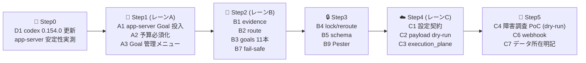

# 📌 OpenAI Agents API × Codex ネイティブ Goal 取り込み調査（2026-09-12）

状態: 調査・検討完了（実装未着手）
対象: 本リポジトリ（Codex StartUp Tools for Linux）への「Codex ネイティブ Goal 活用」および「OpenAI Agents API 取り込み」
調査者: DeepSeek Harness（deepseek-flash）— Web GUI セッション
比較対象: `Claude-StartUpTools-New-Linux`（ClaudeOS v10.1 / v11 P0 ブランチ）

---

## 📋 1. 調査対象と方法

| 種別 | 対象 | 取得方法 | 検証度 |
|---|---|---|---|
| ローカル実測 | `codex-cli 0.153.4`、`~/.codex/goals_1.sqlite`、`~/.codex/state_5.sqlite` | 実測（`codex features list` / `codex doctor` / sqlite3 読み出し） | ✅ 実機確認 |
| バイナリ解析 | Codex 本体 `bin/codex`（258MB）の埋め込み文字列 | `strings` + 抽出（/tmp/codex_strings.txt, 584,342 行） | ✅ 実機確認 |
| プロトコル実測 | `codex app-server` JSON-RPC（`thread/start` → `thread/goal/set` → `thread/goal/get` → `thread/goal/clear`） | **ライブ実行で往復成功** | ✅ 実機確認 |
| 公式doc | `developers.openai.com/api/docs/guides/agents*`（.md 版）、`tools-skills`、`tools-programmatic-tool-calling`、`codex/config-file/config-reference`、`learn.chatgpt.com/docs/developer-commands` | 全文取得（13 ファイル） | ✅ 一次情報 |
| 比較対象実読 | `Claude-StartUpTools-New-Linux` の `lib/goal-router.sh`(821行)、`libexec/goal-extract.sh`(162行)、`goals/*.md`(11本)、`docs/architecture/GOAL_ROUTER.md`、`config/managed-agents.json.template`、v11 P0 監査 | 全文取得 | ✅ 実機確認 |
| 既存調査 | `docs/analysis/claude-code-2026-09-feature-adoption-study.md` | 全文取得 | — |

Web 検索（二次情報）も併用したが、本稿の結論は**一次情報とローカル実測のみ**に依拠している。
二次情報のうち「Agents API = ホスト版 Codex ハーネス」という表現は、公式の
[Architecture](https://developers.openai.com/api/docs/guides/agents-api/architecture) の記述（"The OpenAI-hosted Codex instance that runs the model and tool loop"）と一致することを確認した。

---

## 🔍 2. 最重要の結論（先に要点）

### 2.1 ❗ 前提の訂正: Codex には **すでにネイティブ `/goal` がある**

ユーザー提示の「Claude 側の `/goal` を Codex で活かしたい」という前提は、**半分は不要**である。
Codex CLI 0.153.4 には `features.goals`（stable・既定 ON）として**永続 Goal と自動継続**が実装済みで、
Claude 側の「プロンプト先頭に `/goal "..."` を注入する」方式より**機構として上位**である。

| 機能 | Claude-StartUpTools の `/goal` | **Codex ネイティブ Goal** |
|---|---|---|
| 実体 | 起動プロンプト先頭への文字列注入（`goal-extract__compose`） | `~/.codex/goals_1.sqlite` の永続行 + 自動継続ランタイム |
| 永続化 | なし（プロンプトに埋まるだけ） | `thread_goals` テーブル（status / token_budget / tokens_used / time_used_seconds） |
| 継続 | LLM がプロンプト内の条件を読んで自己継続 | ハーネスがターン終了時に自動継続（`GoalContinuation`） |
| 進捗判定 | プロンプトの文言のみ | ハーネスが前ターンを progress / verified wait / no progress に分類 |
| 完了判定 | LLM の自己申告 | `update_goal` ツール + Completion audit プロンプト |
| 停止 | `- or stop after N turns` | `blocked`（同一ブロッカー **3 連続ターン**）/ `usageLimited` / `budgetLimited` |
| 予算 | TokenBudget.psm1（リポジトリ独自） | `[goals] max_goal_token_budget` + 実行時 `tokenBudget` |
| 上限 | 4,000 字（`GOAL_EXTRACT_MAX_CHARS=4000`） | **4,000 字**（公式doc「at most 4,000 characters」） |
| 投入 | 起動時に1回 | 対話 `/goal`、または app-server RPC `thread/goal/set` |

**4,000 字上限が両者で完全に一致する。** したがって Claude 側の `goals/*.md` は
**11 本すべてがそのまま** Codex ネイティブ Goal の objective として投入できる。

実測（文字数 = Codex の上限判定単位。バイト数ではない点に注意）:

| goal_type | 文字数 | バイト数 | 4,000 字判定 |
|---|---:|---:|---|
| `safe-auto-merge.md` | 2,862 | 4,312 | ok（最大） |
| `product-assurance.md` | 1,836 | 2,906 | ok |
| `development.md` | 1,677 | 2,815 | ok |
| `mvp-release.md` | 1,632 | 2,690 | ok |
| `production-release.md` | 1,582 | 2,865 | ok |
| `assessment.md` | 1,498 | 2,586 | ok |
| `deep-debug.md` | 1,478 | 2,630 | ok |
| `security-emergency.md` | 1,431 | 2,710 | ok |
| `pr-babysit.md` | 1,298 | 2,341 | ok |
| `refactoring.md` | 1,246 | 2,469 | ok |
| `hotfix.md` | 1,242 | 2,309 | ok |

> ⚠️ **実装上の罠**: `safe-auto-merge.md` は UTF-8 で 4,312 **バイト**あるため、
> `(Get-Item).Length` や `stat -c%s`、`${#var}`（LC_ALL=C 時）で判定すると
> 「4,000 超過」と誤判定する。Codex の上限は**文字数**なので、
> PowerShell では `(Get-Content -Raw).Length`（.NET string = UTF-16 コード単位）で判定すること。

### 2.2 では何を移植すべきか — 「Goal Router」のほうが本質

Codex ネイティブ Goal に**欠けている**のは、Claude 側が持つ次の層である。

```text
Claude 側:  Evidence ─▶ Router ─▶ Primary(5) ─▶ Specialized(6) ─▶ 11 templates ─▶ /goal
Codex 側:                                                              （人間が手で /goal と入力）
```

つまり移植価値があるのは **「どの Goal を選ぶか」を状態から自動決定する Router 層**と、
**11 本の検証済み Goal テンプレート**、**session lock / reroute による flapping 防止**である。
Goal の「実行ループ」は Codex ネイティブに任せる（再実装しない）。

### 2.3 ❗ 実運用上の問題を発見: 既存 Goal 2 件が **両方 `blocked`**

`~/.codex/goals_1.sqlite` の実データ（読み取りのみ）:

| thread_id | status | tokens_used | time_used | objective（先頭40字） |
|---|---|---|---|---|
| `01a055ed-…8beeaa` | **blocked** | 349,763 | 3,544 s | 承認済み要件・設計・既存実装を正本として、Construction-DX-Idea… |
| `01a055ff-…b7d2d6` | **blocked** | 367,363 | 3,909 s | 承認済み要件・設計・既存実装を正本として、International-Civil… |

2 件とも `token_budget = NULL`（予算未設定）、約 35 万トークン消費後に `blocked` で停止している。
これは「Codex ネイティブ Goal は動くが、**止まり方の設計が無いまま使われている**」ことを示す。
`budget` と `blocked` 後のハンドリング（Router の reroute 条件）を入れることが本件の実利になる。

### 2.4 OpenAI Agents API は「本物」— ただし位置づけは別レイヤ

公式docで確認した事実（すべて一次情報）:

| 項目 | 確認内容 |
|---|---|
| 提供形態 | 公開ベータ。`POST https://api.openai.com/v1/agents/sessions` + ヘッダ `OpenAI-Beta: agents=v1` |
| 実体 | **OpenAI ホストの Codex ハーネス**。公式表現は "The OpenAI-hosted Codex instance that runs the model and tool loop" |
| OpenAI が管理 | セッション、オーケストレーション、**context compaction**、復旧（recovery）、サブエージェント委譲 |
| Environment | `none` / `openai_hosted`（OpenAI がサンドボックスを用意）/ `self_hosted`（自前 executor を接続） |
| Tools | `programmatic_tool_calling` / `mcp`（http transport）/ `web_search` |
| Multi-agent | `agent.multi_agent = {enabled, max_concurrent_subagents}`（既定 **6**）。ハーネスが create/message/wait/interrupt ツールを供給 |
| Skills | `SKILL.md` + front matter（[agentskills.io 仕様](https://agentskills.io/specification)）。`environment.capability_directories` に**最大 32 ディレクトリ**を登録 |
| Programmatic Tool Calling | モデルが JS を書き、**使い捨て V8 ランタイム**でツールを並列・ループ実行。Node/ネットワーク/FS/サブプロセス/console は無し、状態は実行間で非永続。**Agents API では既定で有効** |
| データ所在 | **米国のみ**。**ZDR 非対応**（self_hosted sandbox でも ZDR にはならない） |
| 課金 | モデルは API レート、OpenAI ツールは標準レート、hosted sandbox はコンテナレート |
| 公式ショーケース | **`agents-api-sev-bot`（Incident response agent）** — ユーザーが挙げた「障害調査エージェント」に対応する公式サンプルが存在 |

**ユーザー提示の 4 項目はすべて公式docに裏付けがある**（誇張・誤りではない）。
ただし「Agents API という新 API が Codex ハーネスを置き換える」のではなく、
**Codex CLI（ローカル）と Agents API（ホスト）は同じハーネスの 2 つの配信形態**である点が正確な理解である。

> ⚠️ 注意: 本リポジトリの `.agents/skills`（67 本）は `SKILL.md` 形式であり、
> **Agents API の `capability_directories` にそのまま投入できる**。逆に Codex CLI 側は
> `skill_search` / `skill_mcp_dependency_install` が stable なので、同じ 67 本を両 Plane で共有できる。

---

## 🧭 3. Codex ネイティブ Goal の確定仕様（実測）

### 3.1 操作面

`/goal` は TUI スラッシュコマンドとして存在する（公式 [developer-commands](https://learn.chatgpt.com/docs/developer-commands) に記載）:

```text
Usage: /goal [<objective>|clear|edit|pause|resume]
```

- `/goal <objective>` 設定 / `/goal` 表示 / `/goal edit` 修正 / `/goal pause` / `/goal resume` / `/goal clear`
- objective は非空かつ **4,000 字以内**。長い指示はファイルに置いて Goal から参照させる
- **`codex exec` に `--goal` フラグは存在しない**（`codex exec --help` 実測）。
  非対話で Goal を扱う唯一の正規路は **app-server JSON-RPC**

### 3.2 永続化スキーマ（`~/.codex/goals_1.sqlite` 実測）

```sql
CREATE TABLE thread_goals (
    thread_id   TEXT PRIMARY KEY NOT NULL,
    goal_id     TEXT NOT NULL,
    objective   TEXT NOT NULL,
    status      TEXT NOT NULL CHECK(status IN (
                  'active','paused','blocked',
                  'usage_limited','budget_limited','complete')),
    token_budget     INTEGER,
    tokens_used      INTEGER NOT NULL DEFAULT 0,
    time_used_seconds INTEGER NOT NULL DEFAULT 0,
    created_at_ms    INTEGER NOT NULL,
    updated_at_ms    INTEGER NOT NULL
);
CREATE TABLE thread_goal_continuation_deferrals (
    thread_id TEXT PRIMARY KEY NOT NULL REFERENCES thread_goals(thread_id) ON DELETE CASCADE
);
```

`codex doctor` は `goals DB ~/.codex/goals_1.sqlite (file) · integrity ok` を報告する。

設定キー: `[goals] max_goal_token_budget`（`GoalsToml` は 1 要素のみ。
上限超過時は `goals.max_goal_token_budget exceeds the maximum supported token budget` で拒否）。

### 3.3 自動化 API（**ライブ往復で検証済み**）

`codex app-server`（stdio JSON-RPC）に対する実測結果:

| メソッド | 用途 | 実測 |
|---|---|---|
| `initialize` | ハンドシェイク | ✅ `{userAgent, codexHome, platformFamily, platformOs}` |
| `thread/start` | セッション作成 | ✅ `{thread:{id, sessionId, model, modelProvider, cwd, path, status}}` |
| `thread/goal/set` | **Goal 設定** | ✅ `{goal:{threadId, objective, status:"active", tokenBudget:null, tokensUsed:0, timeUsedSeconds:0, …}}` |
| `thread/goal/get` | Goal 取得 | ✅ 同形を返却 |
| `thread/goal/clear` | Goal 削除 | ✅ `{cleared:true}` |
| `turn/start` / `turn/steer` / `turn/interrupt` | 実行・途中介入・中断 | （スキーマで存在確認、未実行） |

通知: `thread/goal/updated`（`ThreadGoal` 同梱）、`thread/goal/cleared` が push される（実測）。

パラメータ形状（`codex app-server generate-json-schema` より）:

```json
// ThreadGoalSetParams
{ "threadId": "string (required)",
  "objective": "string | null",
  "status": "active|paused|blocked|usageLimited|budgetLimited|complete | null",
  "tokenBudget": "int64 | null" }
```

> 実測ログ要約: `thread/start` → thread id `01a094ff-…` →
> `thread/goal/set{objective:"PROBE: …", status:"active"}` → `thread/goal/updated` 受信 →
> `thread/goal/get` で同一 Goal を読み戻し成功 → `thread/goal/clear{cleared:true}` →
> `thread/goal/cleared` 受信。**検証用 Goal は削除済み**（DB は元の 2 行に戻っている）。

### 3.4 継続ランタイムの意味論（バイナリ内プロンプト文字列より抽出）

Codex は毎継続ターンに以下の指示をモデルへ与える。**Claude 側の `/goal` テンプレートが手書きしている規律を、
Codex はハーネス側で強制している。**

| ブロック | 内容（要約） |
|---|---|
| Continuation behavior | Goal はターンをまたいで持続。**目的を今のターンに収まるよう縮小してはならない**。未完了なら実状態へ前進させ `active` のまま残す |
| Budget | `tokens_used` / `token_budget` / `remaining_tokens` を提示。`budget_limited` 時は新規実質作業を禁じ、進捗要約と次アクション提示に切り替える |
| Work from evidence | **現在の worktree と外部状態を正本**とする。過去の会話文脈は所在特定の補助に留め、依存前に現状を検査する |
| **No-progress check** | 前ターンを `progress` / `verified wait` / `no progress` に分類。progress = 権威状態の変化・作業完了・次アクションを変える証拠。**status の言い換えや未実行の計画は no progress** |
| Verified wait | 「今まさに生きている」特定の process/session/job/tool handle のポーリングのみ。会話・意図・過去出力・lock/state ファイル単独では不足。**timeout や一時的失敗は terminal ではない → 同じ handle を再ポーリング**。観測期限切れだけを理由に再起動しない |
| Blocked audit | 同一の真のブロッカーが残る場合のみ報告し、閾値到達まで `active` を維持。**表現や次ステップが変わっても等価なブロッカーは同一条件として扱う** |
| Fidelity | 要求された最終状態への前進を最適化。**より狭い・安全・小さな・テストしやすい解にすり替えない** |
| Completion audit | 完了を **未証明**として扱い、目的と参照ファイルから要件を導出し、**明示された要件・番号項目・成果物・コマンド・テスト・ゲート・不変量ごとに権威ある証拠を特定**して現状と突き合わせる。間接的・不確実な証拠は「未達」として扱う |
| Progress visibility | 多段作業では `update_plan` を使い、計画を実目的に紐づけて最新化。計画更新を実作業の代替にしない |

`update_goal` ツールの制約（バイナリ内記述）:

- **明示的に要求されたときだけ Goal を作る**（通常タスクから推測して作らない）
- `token_budget` は明示要求時のみ設定
- `complete` は目的が達成され必須作業が残らないときのみ
- `blocked` は**同一ブロッカーが 3 連続 Goal ターン継続**し impasse のときのみ
- `blocked` から resume したら**新規の blocked audit を開始**
- 予算が尽きそう・作業を止める、という理由で `complete` にしてはならない

> 📌 この 3 連続ターン閾値・resume 後 fresh audit は、**DSH / DeepSeek Harness の `update_goal` と同一仕様**である。
> Codex 系ハーネスの Goal 実装は共通設計であり、本リポジトリの運用規約もこれに合わせられる。

---

## 🗺️ 4. 概念マッピング（Claude → Codex）

| Claude-StartUpTools の資産 | Codex 側の受け皿 | 移植の要否 |
|---|---|---|
| `goals/*.md` の `/goal "..."` 本文（11 本、実測 1,242〜2,862 字） | `/goal <objective>` / `thread/goal/set.objective` | **11 本すべてそのまま流用可**（4,000 字上限内） |
| `goal_extract__block` / `__strip_block` / `__ensure_stop` / `__truncate` | 不要（Codex が 4,000 字検証と継続条件を内蔵） | **廃止** |
| `goal_extract__compose`（プロンプト先頭注入） | `thread/goal/set` + `turn/start` | **置換** |
| `lib/goal-router.sh`（Evidence → Primary/Specialized） | 受け皿なし | **新規移植（本件の中核）** |
| `state.goal_router`（lock / reroute / history） | 受け皿なし（Codex は thread 単位 Goal のみ） | **新規移植** |
| `libexec/goal-router.sh` CLI | 同型 CLI + RPC アダプタ | **新規移植** |
| `goal_router__evidence`（git/CI/gh/runtime/wrangler） | 同左（PowerShell 版） | **新規移植** |
| `execution_plane=managed\|local`（v11 P0） | Agents API セッション | **設計を流用して OpenAI 版を作る** |
| `config/managed-agents.json.template`（Anthropic 版） | OpenAI Agents API 版テンプレート | **対で新設** |
| TokenBudget.psm1 | `[goals] max_goal_token_budget` + `tokenBudget` | **統合** |
| `.agents/skills` 67 本（SKILL.md） | Codex skills + Agents API `capability_directories` | **共通利用** |

---

## 🧪 5. 取り込み候補の評価（3 レーン）

評価軸: 効果（機能追加 / 機能アップ / 効率化）、コスト、リスク、前提。
スコープ制約: 本リポジトリは **Codex only**（Claude 起動機能は対象外）。

### レーンA: Codex ネイティブ Goal を本リポジトリから使い倒す（最優先・低リスク）

| ID | 候補 | 効果 | 優先 | 前提・注意 |
|---|---|---|---|---|
| **A1** | `Start-Codex.ps1` に **app-server 経由の Goal 投入**を実装（`initialize`→`thread/start`→`thread/goal/set`→`turn/start`）。`codex exec` に `--goal` が無い穴を埋める | 非対話・cron でもネイティブ Goal の自動継続が使える | **P1** | app-server は experimental。`codex app-server daemon start` + `--sock` の安定性検証が前提 |
| **A2** | `[goals] max_goal_token_budget` を config へ導入し、TokenBudget.psm1 の残量と整合させる | **既存 2 Goal が予算未設定で 35 万トークン消費し blocked になった問題の再発防止** | **P1** | 上限値の決定が必要（人間判断） |
| **A3** | メニューに「🎯 Goal 管理」を追加（`thread/goal/get` で active/blocked 一覧、pause/resume/clear） | 止まった Goal の可視化と再開 | **P1** | `codex agents` と役割が近い。統合も可 |
| **A4** | `blocked` 到達時の通知（MessageBus へ phase 遷移として publish） | 無人運用で停止に気づける | P2 | — |
| **A5** | `codex exec --json` のイベントから `codex_goal_event` を拾ってダッシュボード表示 | 進捗の可観測性 | P2 | イベント名は要実測（`goal_updated` 系） |
| **A6** | `.codex/hooks.json` で `Stop` 時に Goal 状態を state.json へ反映 | セッション跨ぎの状態整合 | P3 | Codex hooks のフォーマット検証が必要（既存調査 B5 と同じ前提） |

### レーンB: Goal Router の Codex 移植（本件の中核）

| ID | 候補 | 効果 | 優先 |
|---|---|---|---|
| **B1** | `lib/GoalRouter.psm1` 新設。`goal_router__evidence` 相当を PowerShell で実装（state.json / git / CI / gh / runtime） | Router の土台 | **P1** |
| **B2** | Primary 5 / Specialized 6 の分類と `effective_goal_type` 決定、confidence、reason、evidence を移植（`route` は純粋関数として分離） | 状態から Goal を自動決定 | **P1** |
| **B3** | `goals/*.md` 11 本を `config/goals/` へ移植し、`GoalRouter` から `/goal` objective として抽出（**4,000 字検証付き**） | 検証済みテンプレートの再利用 | **P1** |
| **B4** | session lock（既定 12h）+ reroute 条件（Security Critical / CI 新規失敗 / health down / deploy.ready 変化 / phase_mode 変化 / 明示 reroute） | flapping 防止 | **P1** |
| **B5** | `state.json` に `goal_router` ブロックを追加（`state.schema.json` 更新 + Pester のスキーマテスト） | 永続化 | **P1** |
| **B6** | `Start-Codex.ps1 --Goal auto\|<name> --Intent "<text>"`、`-DryRun` で判定のみ表示 | 手動 override | P2 |
| **B7** | fail-safe 連鎖（Router 不正 → explicit → goal_type → phase_mode → mvp-release） | 壊れても起動する | **P1** |
| **B8** | `libexec/Invoke-GoalRouter.ps1`（`--json` / `--explain` / `--dry-run`） | 運用・CI からの利用 | P2 |
| **B9** | Pester テスト（explicit / intent / CI / Security / fallback / malformed / lock / reroute / persist） | 回帰防止 | **P1** |
| **B10** | `docs/architecture/GOAL_ROUTER.md` を本リポジトリ向けに新規作成 | 正本の明示 | P2 |

### レーンC: OpenAI Agents API（Managed Plane）の取り込み

| ID | 候補 | 効果 | 優先 | 前提・注意 |
|---|---|---|---|---|
| **C1** | `config/agents-api.json.template` 新設（`enabled` / `mode=disabled\|dry-run\|live` / `apiBaseUrl` / `betaHeader: agents=v1` / model / `environment.type` / `multi_agent` / `capability_directories` / budget） | 設定契約。**Claude 側 v11 P0 と対の設計** | P2 | 既存の `managed-agents.json.template` と同じ「ID 記録用ではなく実行可能契約へ昇格」方針を踏襲 |
| **C2** | `scripts/tools/agents-api-payload.js` — `POST /v1/agents/sessions` の body 契約生成 + **budget 必須化** | dry-run で全経路を検証可能 | P2 | Claude 側 `managed-session-payload.js` が雛形。budget は後付け不可なので作成時に必須 |
| **C3** | Goal Router に `execution_plane=managed\|local` を追加（**fail-safe で local**） | Goal ごとに実行 Plane を選択 | P2 | Claude 側 v11 P0 と同設計。adapter 不成立時は local へ落とす |
| **C4** | 障害調査エージェント（`agents-api-sev-bot` 相当）を PoC: MCP + `capability_directories` に `.agents/skills`、`programmatic_tool_calling` でログ処理、`multi_agent` で分担 → 1 レポート | **ユーザー要望 4 点の実証** | P2 | **live は課金の人間決裁が前提**。まず dry-run |
| **C5** | `self_hosted` environment で executor を自前接続し、既存の Linux 実行環境を再利用 | ローカル権限・既存スクリプトの再利用 | P3 | executor の lifecycle 管理（reconnect/shutdown）を自前で持つ必要 |
| **C6** | Webhook Gateway で session 状態を Supervisor へ統合 | 無人運用の可観測性 | P3 | 既存調査の P1 Webhook Gateway と同一 |
| **C7** | データ所在・ZDR の制約を運用文書へ明記 | コンプライアンス | **P1（文書のみ）** | **米国のみ・ZDR 非対応**。本番障害ログを投入してよいかの判断が必要 |

### レーンD: 環境更新

| ID | 候補 | 効果 | 優先 |
|---|---|---|---|
| **D1** | `codex` を **0.153.4 → 0.154.0** へ更新（`npm i -g @openai/codex`。`codex doctor` が `newer version is available` と報告） | 最新の Goal / app-server 修正を取り込む | **P1** |
| **D2** | 本リポジトリは `origin/main` と差分 0（`git rev-list --left-right --count HEAD...origin/main` → `0 0`）。**リポジトリ側の更新は不要** | — | 完了 |

---

## 🚫 6. 取り込まない・保留とする項目と理由

| 項目 | 判断 | 理由 |
|---|---|---|
| `goal_extract__*` の移植 | **廃止** | Codex が 4,000 字検証・継続条件・完了監査を内蔵。プロンプト注入はネイティブ Goal の自動継続を潰す |
| Goal 実行ループの再実装（`- or stop after N turns` 等） | **廃止** | ハーネス側の `GoalContinuation` / no-progress check と二重管理になり、`no progress` 判定と衝突する |
| Agents API の live 呼び出し | **保留** | 課金の人間決裁が前提（Claude 側 v11 でも live は `NOT RUN`）。まず dry-run で契約を固める |
| `openai_hosted` sandbox へ本番障害ログを投入 | **保留** | 米国データ所在・ZDR 非対応。投入可否は人間判断 |
| Anthropic Managed Agents の設定をそのまま流用 | **不可** | エンドポイント・イベント名・budget 形式が別物（`/v1/sessions` vs `/v1/agents/sessions`）。**契約は別ファイルに分ける** |
| Codex の `experimental` 機能への依存 | **限定** | app-server は experimental。A1 は daemon 安定性の実測を先行させる |

---

## 🗺️ 7. 推奨ロードマップ



| Step | 内容 | 想定規模 | 検証方法 |
|---|---|---|---|
| 0 | `codex` 0.154.0 へ更新。`codex app-server daemon start` → `proxy` で `thread/goal/*` 往復を再現 | 小 | `codex doctor` の goals DB integrity、RPC 往復ログ |
| 1 | A1〜A3 | 中 | 新規 Pester テスト、`-DryRun` で起動計画、実際に Goal が DB に入り `turn/start` で継続すること |
| 2 | B1〜B3、B7 | 中〜大 | `Invoke-GoalRouter -Explain` の Evidence / Route 出力、11 本すべてが 4,000 字以内であることの機械検証 |
| 3 | B4、B5、B9 | 中 | lock 維持 / reroute 条件 / malformed state の fail-safe を Pester で網羅 |
| 4 | C1〜C3 | 中 | payload JSON をスナップショットテスト。`mode=dry-run` で API を呼ばないこと |
| 5 | C4、C6、C7 | 中 | dry-run のsession body 検証。live は人間決裁後に `NOT RUN` を解除 |

各移植機能には、本リポジトリの成果物基準（目的 / 元機能との対応 / Codex 向け変換メモ / 検証方法）を `docs/migration/` に残す。

---

## ✅ 8. 「十分なハーネスエンジニアリング」として使えるか — 評価

**結論: 使える。ただし「Codex ネイティブ Goal + Goal Router」の組み合わせが本体であり、
Agents API はその上に載る別 Plane として扱うのが正しい。**

| 観点 | 評価 | 根拠 |
|---|---|---|
| Goal ループの堅牢性 | ◎ | no-progress check / verified wait / completion audit / fidelity / blocked 3 連続閾値が**ハーネス側で強制**される |
| 永続性・再開 | ◎ | SQLite 永続 + `thread/resume` + `blocked` からの fresh audit |
| 予算統制 | ○ | `tokenBudget` + `[goals] max_goal_token_budget`。**ただし現状未設定で 35 万トークン消費の実績あり** |
| Goal 選択の自動化 | ✕ → 移植で ◎ | Codex 単体には Router が無い。**本件の中核ギャップ** |
| 証拠に基づくルーティング | ✕ → 移植で ◎ | Claude 側の gh/CI/runtime evidence が無い |
| マルチエージェント | ◎ | `multi_agent` (CLI) / `max_concurrent_subagents` (API, 既定6) |
| スキル再利用 | ◎ | `SKILL.md` 仕様が CLI と API で共通。`.agents/skills` 67 本を両 Plane で共有可能 |
| 大出力のコード内処理 | ◎ | Programmatic Tool Calling（Agents API では既定有効、使い捨て V8） |
| 障害調査 | ◎ | MCP + skills + subagents + 公式 sev-bot ショーケース |
| データ統制 | ⚠️ | Agents API は**米国のみ・ZDR 非対応** |
| 非対話自動化 | △ | `codex exec --goal` が無い。app-server RPC 必須（experimental） |
| 可観測性 | △ | Goal 状態は SQLite にあるが、Supervisor への統合は未実装 |

**最大のギャップは「Goal の選び方」と「予算」であり、「Goal の回し方」ではない。**

---

## ❓ 9. 次アクション（ユーザー判断が必要な点）

> **2026-09-12 更新: 1〜5 はユーザー承認済み。実行結果は §12 を参照。**
> 残る判断は 6（Agents API の live 実行）と、Goal Router（レーンB）の着手可否。

1. **D1: `codex` を 0.154.0 へ更新してよいか。** → ✅ 承認・実行済み
2. **A1 の方式: app-server RPC を採用してよいか。** → ✅ 承認・実装済み
3. **A2/C7: 予算とデータ統制の既定値。**
   - `max_goal_token_budget` の既定値 → ✅ 500000 で確定（§12.2）
   - Agents API に本番障害ログを投入してよいか（米国所在・ZDR 非対応）→ ✅ 承認済み（live 実装は未着手）
4. **B3: `goals/*.md` の抽出方式。** → ✅ 抽出方式で確定（分割不要）
5. **既存 2 Goal の扱い。** → ✅ `clear` で確定・実行済み
6. **C4 の live 実行可否。**
   障害調査エージェント PoC は dry-run までなら追加判断なしで進められる。live は課金承認が必要。

レーンB（Goal Router）と Step4（レーンC）は未着手。次段階の作業ブランチで実装する。

---

## 🔗 10. 参照

### OpenAI 一次情報（2026-09-12 取得）

- https://developers.openai.com/api/docs/guides/agents
- https://developers.openai.com/api/docs/guides/agents-api/overview
- https://developers.openai.com/api/docs/guides/agents-api/architecture
- https://developers.openai.com/api/docs/guides/agents-api/quickstart
- https://developers.openai.com/api/docs/guides/agents-api/multi-agent
- https://developers.openai.com/api/docs/guides/agents-api/sessions
- https://developers.openai.com/api/docs/guides/agents-api/configuration
- https://developers.openai.com/api/docs/guides/agents-api/observability
- https://developers.openai.com/api/docs/guides/tools-skills
- https://developers.openai.com/api/docs/guides/tools-programmatic-tool-calling
- https://developers.openai.com/codex/config-file/config-reference
- https://learn.chatgpt.com/docs/developer-commands
- https://developers.openai.com/showcase/agents-api-sev-bot
- https://agentskills.io/specification

### 本リポジトリ内

- `docs/analysis/claude-code-2026-09-feature-adoption-study.md`（前回調査・P1 修正記録）
- `docs/migration/migration-master-plan.md`
- `.codex/supervisor.json`、`.codex/config.toml`、`state.schema.json`

### 比較対象リポジトリ（読み取りのみ）

- `Claude-StartUpTools-New-Linux/lib/goal-router.sh`
- `Claude-StartUpTools-New-Linux/libexec/goal-extract.sh`
- `Claude-StartUpTools-New-Linux/docs/architecture/GOAL_ROUTER.md`
- `Claude-StartUpTools-New-Linux/config/managed-agents.json.template`
- `Claude-StartUpTools-New-Linux/docs/architecture/audits/2026-09-09-managed-agents-v11-p0.md`

---

## 🛠️ 11. 本調査で実行した検証コマンド（再現用）

```bash
# Codex の機能フラグと Goal 能力
codex features list | grep -E "goals|multi_agent|hooks|skills"
codex doctor                      # → goals DB integrity ok / latest 0.154.0
codex --version                   # → codex-cli 0.153.4

# Goal の永続状態（読み取りのみ）
python3 -c "import sqlite3;c=sqlite3.connect('file:$HOME/.codex/goals_1.sqlite?mode=ro',uri=True);\
print(list(c.execute('select thread_id,status,tokens_used,time_used_seconds,substr(objective,1,40) from thread_goals')))"

# Goal の自動化 API（往復検証。検証後 clear 済み）
codex app-server generate-json-schema --out ./appserver-schema
grep -o '"thread/goal/[a-z]*"' ./appserver-schema/ClientRequest.json | sort -u
python3 probe.py   # initialize → thread/start → thread/goal/set → thread/goal/get → thread/goal/clear

# Codex 内蔵 Goal プロンプト（意味論の確認）
strings <codex-bin> > codex_strings.txt
grep -n "Continue working toward the active thread goal" codex_strings.txt

# リポジトリ鮮度
git fetch --all --prune && git rev-list --left-right --count HEAD...origin/main   # → 0  0
```

> 注: 本調査時点では**読み取りと検証用 Goal の作成/削除のみ**を行い、本リポジトリのファイルは
> 本ドキュメントの新規追加以外に変更していない。既存の `blocked` Goal 2 件には触れていない。

---

## 🛠️ 12. 対応記録（2026-09-12 承認後の実行）

ユーザー承認（D1 / A1 / A2 / 既存 Goal の clear）を受け、以下を実行した。

### 12.1 環境更新と既存 Goal の整理

| # | 実施内容 | 結果 | 検証 |
|---|---|---|---|
| D1 | `npm install -g @openai/codex@0.154.0` | `codex-cli 0.154.0`（0.153.4 から更新） | `codex --version` |
| D1 | 更新前の DB バックアップ | `~/.codex/db-backup-20260912-184846/`（goals / state / queue / memories、SQLite backup API による WAL 安全スナップショット） | 復元可能なスナップショットを確認 |
| D1 | 更新後の健全性 | `goals DB integrity ok` / `state DB integrity ok` / `queue DB integrity ok` / `thread history DB integrity ok`、feature flags 48 → 49 enabled | `codex doctor` |
| — | 既存 `blocked` Goal 2 件を clear | `thread/goal/clear` を RPC で実行し、`thread_goal_cleared` を 2 件受信。goals DB は 0 行 | sqlite 読み出し |

更新後も Goal RPC（set → updated 通知 → get → clear）が 0.154.0 で往復することを再検証した。

### 12.2 予算の既定値（A2）

`.codex/config.toml` に `[goals] max_goal_token_budget = 500000` を追加した。

**既定値 500000 の根拠**: 実測で自律 Goal 2 件が予算未設定のまま
349,763 / 367,363 トークンを消費して `blocked` になった。上限が無いと暴走を止められないため、
実測最大 + 約 36% の余裕を残した値とした。

**実測による意味の確定**: この設定は「上限」ではなく **既定値** である。
`500000` を設定すると tokenBudget 未指定で作った Goal に 500000 が自動で入る
（`12345` を設定すれば 12345 が入ることを実測で確認）。
したがって「予算未設定のまま大量消費する」問題への直接の対策になる。

### 12.3 非対話 Goal 投入の実装（A1）

| ファイル | 内容 |
|---|---|
| `scripts/lib/CodexGoalClient.psm1` | app-server JSON-RPC クライアント。純粋関数（objective 検証・テンプレ抽出・フレーム生成/解析）、セッション（1 接続 = 1 プロセス）、高レベル操作（start / set / get / clear） |
| `scripts/main/Invoke-CodexGoal.ps1` | 非対話 CLI。`validate` / `start` / `set` / `get` / `clear`、`-DryRun`、終了コード 0/1/2 |
| `tests/unit/CodexGoalClient.Tests.ps1` | 30 テスト（純粋関数・セッション Mock・任意の実機 E2E） |
| `tests/unit/Invoke-CodexGoal.Tests.ps1` | 10 テスト（RPC を呼ばない経路・`-DryRun`） |
| `docs/migration/codex-native-goal.md` | 移植メモ（目的 / 元機能対応 / 変換メモ / 検証方法 / 既知制約） |

### 12.4 実装中に実測で判明した設計制約

推測ではなく実機で確認した事実。詳細は `docs/migration/codex-native-goal.md` §3。

1. **スレッドは app-server プロセスが所有する。** `thread/start` したプロセスを閉じた後、
   別プロセスから `thread/goal/set` すると `thread not found`。一方 `thread/goal/clear` は
   thread id だけで成功する。→ 新規作成 + 設定は 1 セッション内で完結、既存スレッドへは
   `thread/resume` してから設定する。
2. **強制 Kill はスレッドを汚す。** `Process.Kill()` はスレッドに `active writer` を残し、
   後続セッションが同じスレッドを開けなくなる。→ stdin を閉じて EOF を送り正常終了を待つ
   （3 秒で終わらなければ Kill）。
3. **`max_goal_token_budget` は既定値**（§12.2）。

### 12.5 検証結果

| 種別 | 結果 |
|---|---|
| Pester 全件（`tests/unit`） | **289 passed / 0 failed / 1 skipped**（skip は実機 E2E の opt-in） |
| Pester 変更前ベースライン | 250 passed / 0 failed |
| 実機 E2E（`CODEX_STARTUP_E2E=1`） | 実 `codex app-server` に対し thread 作成 → Goal 設定 → 別プロセスから取得 → 別プロセスから更新 → 削除まで成功 |
| ArchitectureCheck | CheckedFiles 51 / TotalViolations 0 / Passed true |
| CLI 実機確認 | Claude 側 `goals/deep-debug.md` を `-Action validate -Template` で 1,274 字として受理（4,000 字以内） |
| 後始末 | 検証用 Goal はすべて削除済み（goals DB 0 行）、残留 app-server プロセス 0 |

### 12.6 残課題

> **2026-09-12 追補: 1〜4 は実装済み。詳細は §13。**

1. ~~Goal Router（レーンB）未着手~~ → ✅ §13.2
2. ~~`Start-CodexGoalRun` はスレッドを登録するが駆動しない~~ → ✅ §13.1
3. ~~メニュー統合（A3）未着手~~ → ✅ §13.3
4. ~~レーンC（OpenAI Agents API / Managed Plane）未着手~~ → ✅ §13.4（dry-run 契約まで）
5. `codex doctor` が `rollout files are missing from the state DB`（996 ファイル / 987 行）を
   警告する。**本件の更新とは無関係の既存のデータ衛生問題**であり、本作業では触れていない。

---

## 🧭 13. 追補（2026-09-12）: レーンB / セッション駆動 / メニュー / レーンC

### 13.1 app-server は Goal を自動継続しない（実測）→ 外部駆動を実装

`thread/goal/set` → `turn/start` を 100 秒観測した結果、`turn/started` / `thread/goal/updated`
（status=active, tokens=7997）/ `turn/completed` は届くが、**継続 turn は来なかった**。
app-server 単体では Goal は回らず、TUI 側の idle 継続に依存している。

→ `Invoke-CodexGoalRun` を実装。**同一 app-server セッションを保持したまま**
`turn/start` → `turn/completed` 待ち → `thread/goal/get` で status 確認 → 継続 turn 送出
をループし、終端 status（complete / blocked / usageLimited / budgetLimited）または
`MaxTurns` / `MaxMinutes` / turn タイムアウトで停止する。
継続プロンプトは Codex ネイティブの継続指示と同じ規律を外部から与える。

**実機検証**: 1 ターンで `finalStatus=complete` / `stopReason=goal-complete`。
モデルの `update_goal status=complete` を検出して停止した。

### 13.2 Goal Router（レーンB）— 移植完了

`scripts/lib/GoalRouter.psm1`（17 関数）+ `config/goals/*.md`（11 本）+ 58 テスト。

- Primary 5 / Specialized 6 の分類・許可関係、13 段階の優先順位ルーティング
- Evidence 収集（state.json / git / CI / gh / runtime / intent）は `Get-GoalRouterEvidence` に閉じ込め、
  `Invoke-GoalRouterRoute` は**純粋関数**のまま（テスト容易性を Claude 側から継承）
- session lock（既定 720 分）と reroute 条件、fail-safe（必ず 1 つの Goal を返す）
- `state.json` の `goal_router` ブロックへ原子的永続化（一時ファイル + 置換、他キー不変）
- テンプレートは Router の `effective` から解決し、`Invoke-CodexGoalRun` へ渡す

**検証**: 15 のルーティング規則が Claude 参照実装と一致することをスモークで確認。
11 テンプレートすべてが 4,000 字以内で objective を抽出できることを機械検証（1,067〜1,409 字）。

### 13.3 メニュー統合（A3）

`StartupMenu.psm1` に `14. Goal 管理`。Router 判定は `-NoPersist -SkipGitHub -SkipRuntime` で
表示のみ（メニュー操作で state.json を書き換えず、ネットワークも使わない）。
Goal 一覧（`Get-CodexGoalList` — goals DB を python3/sqlite3 で読み取り専用参照）と、
11 テンプレートからの選択 + `yes` 確認つき Goal 設定。

### 13.4 レーンC（Agents API）— dry-run 契約まで

`scripts/lib/AgentsApiPayload.psm1` + `config/agents-api.json.template` + 33 テスト。

**重要な訂正**: **OpenAI Agents API には session budget フィールドが存在しない。**
公式doc（overview / architecture / multi-agent / configuration / observability）に
Anthropic 版 `max_list_cost` に相当する記載が無い。したがって「budget 必須」を API に
渡す形では実装できないため、予算統制は **localCostGuard（人間承認 + 見積上限）** という
ローカルゲートとして実装した。live は次の 4 条件が揃うまで fail-safe で拒否する:
`enabled` / `mode=live` / `localCostGuard.approvalId` / `dataResidency.approved`。

payload は公式の curl 例と同型であることを実測確認（推測フィールドを足していない）。
`maxEstimatedUsd` による自動停止は**未実装**（コスト実測手段が未確立のため記録項目に留める）。

### 13.5 追補分の検証結果

| 種別 | 結果 |
|---|---|
| Pester 全件 | **394 passed / 0 failed / 1 skipped**（追補前 289） |
| ArchitectureCheck | CheckedFiles 55 / TotalViolations 0 |
| 実機ドライバ | 1 ターンで complete 検出 |
| 後始末 | 検証用 Goal はすべて削除済み（goals DB 0 行）、残留 app-server プロセス 0 |

### 13.6 次段階

1. `maxEstimatedUsd` による実コスト停止（Observability / Usage API との接続が必要）
2. `self_hosted` executor の接続実装と Webhook Gateway（Supervisor 統合）
3. 障害調査エージェント PoC の live 実行（課金承認後）
4. レーンA の残り（A4 blocked 通知 / A5 ダッシュボード表示 / A6 hooks 連携）
