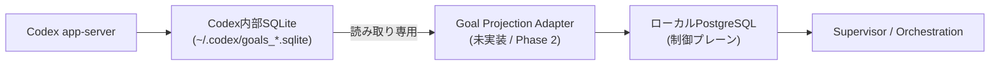

# ローカルPostgreSQL制御プレーン 運用仕様（draft）

状態: 2026-09-13 draft（Phase 0: 方針・仕様のみ、実装なし）
正本: 本ファイル
関連: `AGENTS.md` §11 / `CLAUDE.md` §11、`docs/analysis/local-postgresql-orchestration-policy-conflict.md`

## 1. 目的と適用範囲

Codexネイティブ Goal 実行基盤（本リポジトリ）と、他のAIオーケストレーション基盤
（例: DeepSeek Harness系リポジトリ）が共有しうる、次の運用状態を保存する制御プレーンとして
ローカル（自己ホスト）PostgreSQLを用いる。

- Task／Run／Step
- Approval（Human Gate判断の記録）
- Audit Event
- Codex Goal Projection（`~/.codex/goals_*.sqlite` からの読み取り専用投影）

対象外:
- 外部公開Webサービスの本番データ（`AGENTS.md`／`CLAUDE.md` §5の対象）
- Codex内部状態そのものの置き換え（`~/.codex/goals_*.sqlite` は一次情報のまま維持する）

## 2. 位置づけ（レイヤー分離）

Codex内部SQLiteは一次状態として維持し、直接DDLや更新は行わない。PostgreSQLへは
読み取り専用の投影（Shadow Projection）としてのみ書き込む。投影処理自体はPhase 2以降の
実装対象であり、本ドキュメントの時点ではスキーマ・運用方針の定義のみを行う。

## 3. 接続情報（placeholder）

具体的な接続文字列・資格情報は本リポジトリへ記載しない。導入時に以下を確定し、
このセクションを更新する。

| 項目 | 現状 | 備考 |
|---|---|---|
| 接続方式 | 未確定（placeholder） | Unix socket / TCP のいずれかを導入時に確定する |
| 環境変数名 | 未確定（placeholder例: `LOCAL_PG_CONNECTION_STRING` / `ORCHESTRATION_PG_DSN`） | 値は `~/.bashrc` 等ホスト側にのみ保持し、リポジトリ・ログ・PR・commitへ出力しない |
| DB名 | 未確定（placeholder） | 制御プレーン専用DBを分離し、他プロジェクトのDBと共用しない |
| 参考観測 | 2026-09-12時点でこのホストの `/var/run/postgresql:5432` でPostgreSQL待受を確認済み（`docs/analysis/runtime-readiness-2026-09-12.md`） | DB名・ロール・スキーマは未確定。既存インスタンスを転用するか新規に用意するかは導入時に決定する |

`config/config.json.template` へ環境変数名のplaceholderを追記するのはPhase 1（実装着手）で行う。

## 4. 接続方式の推奨

PowerShellから直接PostgreSQLへ接続する方式（Npgsql等）と、ローカルControl Plane API
経由の方式を比較し、後者を推奨する。

- 推奨: ローカルControl Plane API経由
  - StartUpTools側がDB接続情報・ドライバ依存を直接持たずに済む
  - DeepSeek Harness等、他のAIオーケストレーション基盤とスキーマ・アクセス制御を共有しやすい
- 非推奨（初期段階では避ける）: PowerShellからNpgsql等で直接接続
  - PowerShell側にDBドライバ依存が増える
  - 複数リポジトリから同一DBへ直接接続すると、アクセス制御・スキーマ変更の整合性維持が難しくなる

## 5. スキーマ・migration方針

- 追加（additive）かつ後方互換のmigrationを既定とする
- 破壊的変更（drop／型変更／NOT NULL化等）は本番適用前にHuman Gate対象とする
- migration・rollbackは作業ブランチ上で検証してからPRに含める
- スキーマ定義・migrationファイルは将来 `db/migrations/` 配下に置く（本ドキュメント時点では未作成）

## 6. Human Gate

次の操作は自律実行せず、`CLAUDE.md`／`AGENTS.md` §7（Mandatory stop conditions）に従い
ユーザーの明示的な承認を得る。

- 破壊的migration（drop／delete／reset）
- 本番データの削除・上書き
- 制御プレーンDBの外部公開設定変更
- 資格情報・接続文字列のrotationや保存場所変更

## 7. 未実装事項（Phase 1以降）

本ドキュメントはPhase 0（方針・仕様策定）の成果物であり、以下は未実装。

- `PostgreSqlStore.psm1` 等の接続クライアント実装
- Migration CLI
- Schema Version管理
- Health Check
- Codex Goal Projection Adapter（Phase 2）
- Task／Run／Approval／Audit APIの実装（Phase 3）

## 8. 検証方法（実装着手時）

- ローカルPostgreSQLへの接続確認（Health Check）
- migration適用・rollbackの往復確認
- 破壊的操作がHuman Gateを経由せず実行されないことをテストで確認
- Codex内部SQLiteへの書き込みが発生しないことを確認（読み取り専用の担保）
