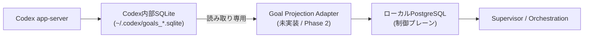

# ローカルPostgreSQL制御プレーン 運用仕様

状態: 2026-09-13（Phase 1: 実装・実DB接続検証済み）
正本: 本ファイル
関連: `AGENTS.md` §11 / `CLAUDE.md` §11、`docs/analysis/local-postgresql-orchestration-policy-conflict.md`

## 1. 目的と適用範囲

Codexネイティブ Goal 実行基盤（本リポジトリ）と、他のAIオーケストレーション基盤
（例: DeepSeek Harness系リポジトリ）が共有しうる、次の運用状態を保存する制御プレーンとして
ローカル（自己ホスト）PostgreSQLを用いる。

- Task／Run／Step
- Approval（Human Gate判断の記録）
- Audit Event
- Codex Goal Projection（`~/.codex/goals_*.sqlite` からの読み取り専用投影）

対象外:
- 外部公開Webサービスの本番データ（`AGENTS.md`／`CLAUDE.md` §5の対象）
- Codex内部状態そのものの置き換え（`~/.codex/goals_*.sqlite` は一次情報のまま維持する）

## 2. 位置づけ（レイヤー分離）

Codex内部SQLiteは一次状態として維持し、直接DDLや更新は行わない。PostgreSQLへは
読み取り専用の投影（Shadow Projection）としてのみ書き込む。投影処理自体はPhase 2以降の
実装対象であり、本ドキュメントの時点ではスキーマ・運用方針の定義のみを行う。

## 3. 接続情報

具体的な接続文字列・資格情報（パスワード）は本リポジトリへ記載しない。

| 項目 | 内容 |
|---|---|
| 接続方式 | TCP（127.0.0.1:5432、`scram-sha-256`）。Unixソケットの`peer`認証は使わない（専用ロール名とOSユーザー名が一致しないため） |
| 環境変数名 | `ORCHESTRATION_PG_DSN`（`postgresql://<role>:<password>@127.0.0.1:5432/<dbname>`形式）。値は `~/.config/environment.d/99-codex-orchestration.conf`（0600）にのみ保持し、リポジトリ・ログ・PR・commitへ出力しない |
| DB名 | `codex_startup_orchestration`（2026-09-13、ユーザー承認のうえ新規作成） |
| ロール名 | `codex_orchestration_app`（`NOSUPERUSER NOCREATEDB NOCREATEROLE NOINHERIT`の最小権限、パスワードは`scram-sha-256`で自動生成） |
| 共有インスタンスに関する注記 | このホストのPostgreSQLインスタンスは、確認できただけで10件以上の他プロジェクト（社内DX/社外DX相当）が同居する共有インスタンスである。専用DB・専用ロールを分離して作成し、他プロジェクトのDB・スキーマには一切触れていない |

`config/config.json.template` の `orchestration.connectionEnvVar` は `ORCHESTRATION_PG_DSN` を指す（値はplaceholderのまま）。

## 4. 接続方式の推奨

PowerShellから直接PostgreSQLへ接続する方式（Npgsql等）と、ローカルControl Plane API
経由の方式を比較し、後者を推奨する。

- 推奨: ローカルControl Plane API経由
  - StartUpTools側がDB接続情報・ドライバ依存を直接持たずに済む
  - DeepSeek Harness等、他のAIオーケストレーション基盤とスキーマ・アクセス制御を共有しやすい
- 非推奨（初期段階では避ける）: PowerShellからNpgsql等で直接接続
  - PowerShell側にDBドライバ依存が増える
  - 複数リポジトリから同一DBへ直接接続すると、アクセス制御・スキーマ変更の整合性維持が難しくなる

## 5. スキーマ・migration方針

- 追加（additive）かつ後方互換のmigrationを既定とする
- 破壊的変更（drop／型変更／NOT NULL化等）は本番適用前にHuman Gate対象とする
- migration・rollbackは作業ブランチ上で検証してからPRに含める
- スキーマ定義・migrationファイルは将来 `db/migrations/` 配下に置く（本ドキュメント時点では未作成）

## 6. Human Gate

次の操作は自律実行せず、`CLAUDE.md`／`AGENTS.md` §7（Mandatory stop conditions）に従い
ユーザーの明示的な承認を得る。

- 破壊的migration（drop／delete／reset）
- 本番データの削除・上書き
- 制御プレーンDBの外部公開設定変更
- 資格情報・接続文字列のrotationや保存場所変更

## 7. 実装状況（2026-09-13, Phase 1）

Phase 1でコード基盤を実装し、専用DB・ロールを新規作成して実DB接続検証まで完了した。

実装済み:
- `scripts/lib/PostgreSqlStore.psm1`（psql CLI経由の接続・Retry・Circuit Breaker・Health Check）
- `scripts/lib/OrchestrationCommon.psm1`（ID生成・SQLリテラルエスケープ・File Fallback共通処理）
- `scripts/lib/OrchestrationRepository.psm1`（Task／Run）
- `scripts/lib/ApprovalRepository.psm1`（Human Gate判断の記録）
- `scripts/lib/AuditRepository.psm1`（監査イベントの追記記録）
- `scripts/lib/OrchestrationMigration.psm1` / `scripts/main/Invoke-OrchestrationMigration.ps1`（migration CLI、Schema Version管理）
- `scripts/main/Test-OrchestrationHealth.ps1`（Health Check CLI）
- `db/migrations/0001_init.sql`（初期スキーマ、additive。`orchestration_audit_events.id`は実接続検証で発見した型不整合（`BIGSERIAL`→`UUID`）を修正済み）
- `config/config.json.template` の `orchestration` セクション（値はplaceholder、変数名は確定）
- 専用DB `codex_startup_orchestration` ／専用ロール `codex_orchestration_app`（§3参照）

実装中に発見・修正したバグ（実DB接続検証で判明。File Fallbackのみのテストでは検出できなかった）:
- `Get-OrchestrationAppliedMigration`がPowerShellの「関数から空配列を返すと呼び出し元で$nullにアンラップされる」仕様により、「接続不可」と「未適用0件」を区別できていなかった。戻り値を`[pscustomobject]@{Ok;Versions}`に変更して修正
- `Set-StrictMode`環境下で空配列に対する`.Property`直接アクセス（member enumeration）がエラーになる箇所があった。パイプライン経由のプロパティ展開に変更して修正
- `orchestration_audit_events.id`が`BIGSERIAL`のままで、Repository側がUUID文字列を渡す設計と型不整合を起こしていた。DDLを`UUID`に統一して修正

未実装（Phase 4以降）:
- PgBouncer接続対応

## 8. 検証方法・実施結果（2026-09-13, Phase 1）

- ローカルPostgreSQLへの接続確認（Health Check）: `scripts/main/Test-OrchestrationHealth.ps1` で実施。未接続時Healthy=false、接続後Healthy=trueをいずれも確認
- File Fallback経路: Pester単体テストで検証済み（`ORCHESTRATION_PG_DSN`未設定時）
- 実DB接続・migration適用・rollbackの往復確認: **実施済み**。dry-run→apply→再dry-run（pending空、冪等性確認）→テーブル作成確認（`\dt`）まで実施
- Task／Run／Approval／Auditの実DB書き込み: **実施済み**。全リポジトリ関数でSource=postgresqlとなることを確認し、検証データはTRUNCATEで削除済み
- 破壊的操作がHuman Gateを経由せず実行されないことの確認: §10参照（Phase 3で基盤実装済み。実際の破壊的操作フローへの組み込みはPhase 4以降）

## 9. Codex Goal Shadow Projection（2026-09-13, Phase 2）

`~/.codex/goals_*.sqlite`（`thread_goals`テーブル）からの読み取り専用投影を実装した。

実装済み:
- `scripts/lib/CodexGoalProjection.psm1`（`Sync-CodexGoalProjection` / `Get-CodexGoalProjection` / `Set-CodexGoalProjectionRecord`）
- `scripts/main/Sync-CodexGoal.ps1`（同期CLI）
- `db/migrations/0002_codex_goal_projection.sql`（`codex_goal_projections`テーブル、`thread_id`をPRIMARY KEYとしたUPSERTで重複登録を防止）
- `scripts/lib/CodexGoalClient.psm1`の`Get-CodexGoalList`/`ConvertFrom-CodexGoalListJson`に`GoalId`を追加（後方互換な拡張。既存のSELECT文に`goal_id`列を追加しただけで、既存呼び出し元の挙動は変えていない）

設計判断（合理的な仮定として決定）:
- Task/Run/Approval/Auditの汎用テーブルとは別に専用テーブル`codex_goal_projections`を新設した。理由: Goal固有フィールド（token_budget等）を型付きで保持でき、Codex内部状態の投影であることを汎用オーケストレーションデータと明確に区別できるため
- Codex内部SQLite（`~/.codex/goals_*.sqlite`）への書き込みは一切行わない。`Get-CodexGoalList`（既存の読み取り専用関数）をそのまま呼び出し、投影先（PostgreSQL）への書き込みのみをAdapterが担当する
- Codex Goal DBが存在しない、またはPostgreSQLが未接続の場合はいずれも例外を投げず、`Ok=$false`で縮退する（`Reason`で原因を区別）

検証結果:
- Codex Goal DB不在時の縮退動作: 確認済み
- PostgreSQL未接続時の縮退動作: 確認済み
- 実DB接続時のUPSERT（新規作成・重複更新）と`Get-CodexGoalProjection`での取得: 確認済み（検証データはTRUNCATE済み）
- Codex内部SQLiteへの書き込みが発生しないことの確認: `Get-CodexGoalList`は`sqlite3 -readonly` / `sqlite3.connect(..., mode=ro)`を使う既存実装のままであり、本Adapterはこれを呼び出すのみで独自の書き込みロジックを追加していないことをコードレビューで確認

未実装（Phase 4以降）:
- 投影結果に基づく実際のルーティング判断（本Phaseは既存Goal Router判定結果の記録のみ）

## 10. Task Queue／Goal Router統合／Human Gate（2026-09-13, Phase 3）

Task/Run/Approval/Auditの基盤（Phase 1）の上に、オーケストレーション実行の中核機能を実装した。

### 10.1 Task Queue

実装済み:
- `db/migrations/0003_task_queue.sql`: `orchestration_tasks`へ`priority`／`leased_until`／`leased_by`をadditiveに追加
- `scripts/lib/TaskQueue.psm1`:
  - `Get-NextOrchestrationTask`: `UPDATE ... WHERE id = (SELECT ... FOR UPDATE SKIP LOCKED LIMIT 1) RETURNING ...`の単一SQL文で、優先度(`priority DESC`)→作成日時(`created_at ASC`)順に1件をアトミックにリースする（Execution Lease）
  - `Send-OrchestrationTaskHeartbeat`: リース期限の延長（Heartbeat）
  - `Complete-OrchestrationTask`: 完了・失敗時のリース解放
  - `Get-StaleOrchestrationTask` / `Reset-StaleOrchestrationTask`: リース期限切れタスクの検出・`pending`への回収（Stale Run回収）
- `scripts/main/Invoke-OrchestrationTaskQueue.ps1`: Lease/Heartbeat/Complete/Fail/RecoverStale/ListStaleのCLI
- `scripts/lib/OrchestrationRepository.psm1`の`Add-OrchestrationTask`へ`-Priority`パラメータを追加（後方互換、既定値0）

Task QueueはPostgreSQL必須機能とし、File Fallbackは持たない（未接続時は`Ok=$false`）。理由: 複数Workerの排他制御（`FOR UPDATE SKIP LOCKED`）はファイルベースでは安全に実現できないため。

未実装（Phase 4以降）: Retry Budget（再試行回数の上限管理）、Cost Budget、Time Budget、Dependency Graph、Stagnation Detection。

### 10.2 Goal Router統合

実装済み:
- `scripts/lib/GoalRouterOrchestration.psm1`: `Sync-GoalRouterOrchestrationEvent`
- 既存の`GoalRouter.psm1`（`Resolve-GoalRouter`/`Invoke-GoalRouterRoute`）は一切変更せず、その戻り値をAudit Event（`event_type='goal_router.routed'`）として記録する疎結合な統合レイヤーとして追加した

未実装（Phase 4以降）: 投影結果・Audit履歴に基づく実際のルーティング判断へのフィードバック、Agent Adapter、Model Routing。

### 10.3 Human Gate統合

実装済み:
- `db/migrations/0004_human_gate.sql`: `orchestration_approvals`へ`requested_at`をadditiveに追加し、`decided_at`の`NOT NULL`／既定値制約を緩和（`decision='pending'`を表現可能にする。既存の`CHECK`制約は元々無く、PowerShell側の`ValidateSet`でのみ制限されていたため、DB側の制約変更は列制約の緩和のみ）
- `scripts/lib/ApprovalRepository.psm1`へ追加: `Request-OrchestrationHumanApproval`（承認待ち作成）、`Approve-OrchestrationHumanGate`／`Deny-OrchestrationHumanGate`（決定の記録、`WHERE decision = 'pending'`で二重決定を防止）、`Get-PendingOrchestrationHumanApproval`（未決一覧）
- `scripts/main/Invoke-OrchestrationHumanGate.ps1`: Request/ListPending/Approve/DenyのCLI

Human GateもPostgreSQL必須機能とし、File Fallbackは持たない（未接続時は`Ok=$false`）。理由: 承認待ち状態を「なかったこと」にできてしまうFile Fallbackは、承認ゲートの安全性を損なうため（安全側に倒す設計）。

**重要な運用上の注意**: `Approve-OrchestrationHumanGate`／`Deny-OrchestrationHumanGate`はAPI呼び出しであり、AGENTS.md/CLAUDE.md §6の「現在の質問に対するユーザーの明示的な回答だけを有効とする」方針を代行しない。これらの関数を呼ぶ主体（CLI操作者、将来の自動化フロー）が、実際にユーザーの明示的なY/N回答を得たうえで呼び出す運用を徹底する必要がある。本Phaseはこの運用を強制する仕組み（例: 呼び出し元の認証・監査）までは実装していない。

未実装（Phase 4以降）: Approve/Deny呼び出し元の認証・監査強化、Supervisor manifestの`humanDecisionRequired`との自動連携、Slack等の外部通知連携。

### 10.4 検証結果（2026-09-13）

- Task Queue: Lease→Heartbeat→Complete、排他制御（同時リースされないこと）、Stale Run回収（期限切れ→pending復帰）を実DB接続で検証済み
- Goal Router統合: ダミーのRoute結果をAudit Eventとして記録できることを確認済み（File Fallback・実DB接続の双方）
- Human Gate: Request→ListPending→Approve、Request→Deny、二重決定が更新されないことを実DB接続で検証済み
- 検証データは全てTRUNCATEで削除済み
